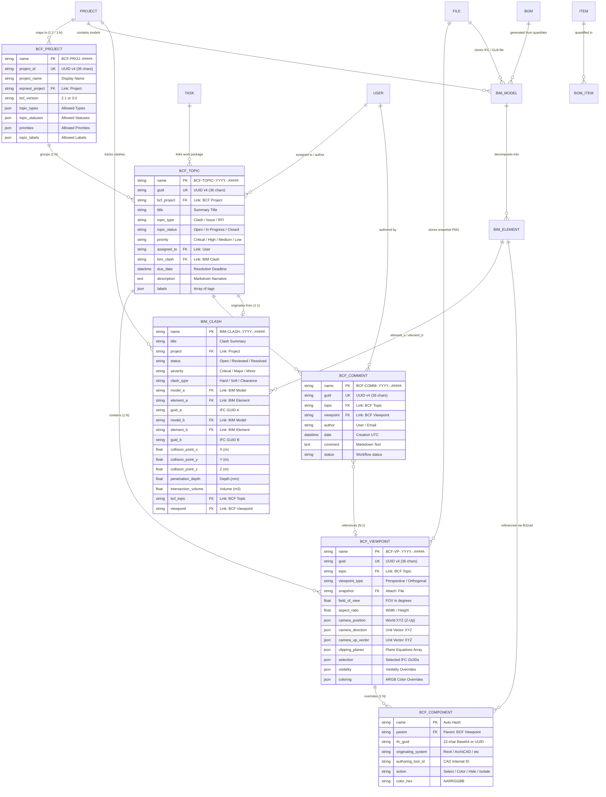

# Technical Specifications & Frappe DocType Schemas: OpenProject BIM & BCF Integration

**Document Reference**: `DOC-OPBIM-03`  
**Standard Compliance**: buildingSMART BCF-XML v2.1/v3.0, buildingSMART BCF-API v2.1/v3.0, Frappe Framework v14/v15, ERPNext Construction  
**Status**: Authoritative Technical Specification & Database Blueprint  
**Target Module**: `construction_bim.bim`  

---

## 1. Executive Architecture & Schema Foundations

The Building Information Modeling (BIM) Collaboration Format (BCF), standardized by buildingSMART International (ISO 16739 / bSI standards), provides an open, vendor-neutral data structure for communicating design issues, RFIs, clashes, and coordination remarks across disparate Architecture, Engineering, and Construction (AEC) authoring applications (e.g., Revit, ArchiCAD, Tekla, Solibri, Navisworks, BlenderBIM) without transmitting massive monolithic IFC geometry models.

In this architecture, the Frappe/ERPNext framework acts as a centralized **Common Data Environment (CDE)** and BCF Server. To achieve complete semantic parity with OpenProject BIM and the buildingSMART BCF specifications, we introduce six primary DocTypes into the `construction_bim` module:

1. **`BCF Project`**: Master container grouping topics, defining extension vocabularies (types, statuses, priorities, labels, stages), and linking to native ERPNext `Project` records.
2. **`BCF Topic`**: The fundamental unit of collaboration, tracking title, description, priority, status, assignee, stage, audit timestamps, and related topics.
3. **`BCF Viewpoint`**: The 3D spatial bookmark encapsulating camera parameters (perspective or orthogonal), field of view, aspect ratio, cutting clipping planes, component selection, component visibility overrides, component color overrides, and rendered snapshot images.
4. **`BCF Comment`**: Threaded discussion entries attached to a topic, maintaining chronological discussion history, markdown content, and optional viewpoint attachments.
5. **`BCF Component`**: A child DocType representing individual IFC components identified by `IfcGuid` (22-character IFC Base64 or standard 36-character UUID) for element-level isolation, selection, and color overrides.
6. **`BIM Clash`**: A high-level issue DocType recording physical element-to-element intersections discovered by the 3D collision engine, storing colliding element pairs, spatial collision coordinates, penetration depth, intersection volume, and bi-directional links to BCF topics and ERPNext tasks.

---

## 2. Global Entity Relationship Architecture

The diagram below illustrates the relational mapping between the native Frappe BCF DocTypes, the 3D model structures in `construction_bim`, and the core ERPNext business modules (`Project`, `Task`, `Item`, `BOM`, `File`, `User`).



---

## 3. Comprehensive Frappe DocType Schemas

### 3.1 `BCF Project` DocType Blueprint

The `BCF Project` represents a project boundary within the BCF API and BCF-XML containers. It encapsulates allowed extension vocabularies (types, statuses, priorities, labels, and stages) ensuring strict data validation.

#### JSON Schema (`bcf_project.json`):
```json
{
  "name": "BCF Project",
  "module": "BIM",
  "doctype": "DocType",
  "issubmittable": 0,
  "istable": 0,
  "autoname": "format:BCF-PROJ-{#####}",
  "title_field": "project_name",
  "search_fields": "project_name,project_id,erpnext_project",
  "field_order": [
    "project_name",
    "project_id",
    "erpnext_project",
    "bcf_version",
    "status",
    "column_break_stats",
    "topic_count",
    "open_topic_count",
    "section_break_extensions",
    "topic_types",
    "topic_statuses",
    "priorities",
    "topic_labels",
    "stages",
    "snippet_types",
    "section_break_audit",
    "created_by_user",
    "modified_by_user"
  ],
  "fields": [
    {
      "fieldname": "project_name",
      "fieldtype": "Data",
      "label": "BCF Project Name",
      "reqd": 1,
      "in_list_view": 1,
      "in_global_search": 1
    },
    {
      "fieldname": "project_id",
      "fieldtype": "Data",
      "label": "BCF Project GUID",
      "unique": 1,
      "reqd": 1,
      "in_list_view": 1,
      "in_standard_filter": 1,
      "description": "RFC 4122 UUID v4 identifying the project in the buildingSMART BCF REST API."
    },
    {
      "fieldname": "erpnext_project",
      "fieldtype": "Link",
      "label": "ERPNext Project",
      "options": "Project",
      "in_list_view": 1,
      "in_standard_filter": 1,
      "description": "Optional mapping to ERPNext Project master for cost and schedule integration."
    },
    {
      "fieldname": "bcf_version",
      "fieldtype": "Select",
      "label": "BCF Version",
      "options": "2.1\n3.0",
      "default": "2.1",
      "reqd": 1,
      "in_list_view": 1
    },
    {
      "fieldname": "status",
      "fieldtype": "Select",
      "label": "Status",
      "options": "Active\nArchived\nClosed",
      "default": "Active",
      "in_list_view": 1,
      "in_standard_filter": 1
    },
    {
      "fieldname": "column_break_stats",
      "fieldtype": "Column Break"
    },
    {
      "fieldname": "topic_count",
      "fieldtype": "Int",
      "label": "Total Topics",
      "read_only": 1,
      "default": "0"
    },
    {
      "fieldname": "open_topic_count",
      "fieldtype": "Int",
      "label": "Open Topics",
      "read_only": 1,
      "default": "0"
    },
    {
      "fieldname": "section_break_extensions",
      "fieldtype": "Section Break",
      "label": "Allowed Extensions & Vocabularies",
      "description": "Allowed enumerated values conforming to BCF extensions.xml / extensions.json"
    },
    {
      "fieldname": "topic_types",
      "fieldtype": "Code",
      "options": "JSON",
      "label": "Topic Types",
      "default": "[\"Clash\", \"Issue\", \"Inquiry\", \"Request\", \"Remark\", \"Fault\", \"Warning\"]"
    },
    {
      "fieldname": "topic_statuses",
      "fieldtype": "Code",
      "options": "JSON",
      "label": "Topic Statuses",
      "default": "[\"Open\", \"In Progress\", \"Resolved\", \"Approved\", \"Closed\", \"Rejected\"]"
    },
    {
      "fieldname": "priorities",
      "fieldtype": "Code",
      "options": "JSON",
      "label": "Priorities",
      "default": "[\"Critical\", \"High\", \"Medium\", \"Low\"]"
    },
    {
      "fieldname": "topic_labels",
      "fieldtype": "Code",
      "options": "JSON",
      "label": "Labels / Categories",
      "default": "[\"Architecture\", \"Structural\", \"MEP\", \"HVAC\", \"Electrical\", \"Plumbing\", \"Fire Protection\", \"Site\", \"Safety\"]"
    },
    {
      "fieldname": "stages",
      "fieldtype": "Code",
      "options": "JSON",
      "label": "Project Stages",
      "default": "[\"Concept\", \"Design Development\", \"Coordination\", \"Permitting\", \"Construction\", \"As-Built\"]"
    },
    {
      "fieldname": "snippet_types",
      "fieldtype": "Code",
      "options": "JSON",
      "label": "BIM Snippet Types",
      "default": "[\"IFC4\", \"IFC2X3\", \"JSON\"]"
    },
    {
      "fieldname": "section_break_audit",
      "fieldtype": "Section Break",
      "label": "Audit Information"
    },
    {
      "fieldname": "created_by_user",
      "fieldtype": "Data",
      "label": "Created By",
      "read_only": 1
    },
    {
      "fieldname": "modified_by_user",
      "fieldtype": "Data",
      "label": "Last Modified By",
      "read_only": 1
    }
  ],
  "permissions": [
    {
      "role": "System Manager",
      "read": 1,
      "write": 1,
      "create": 1,
      "delete": 1,
      "report": 1
    },
    {
      "role": "Projects Manager",
      "read": 1,
      "write": 1,
      "create": 1,
      "delete": 0,
      "report": 1
    },
    {
      "role": "Projects User",
      "read": 1,
      "write": 1,
      "create": 1,
      "delete": 0,
      "report": 1
    }
  ]
}
```

---

### 3.2 `BCF Topic` DocType Blueprint

The `BCF Topic` DocType stores standard BCF issues. It maintains strict compliance with both BCF-XML `markup.bcf` and BCF-API Topic schemas.

#### JSON Schema (`bcf_topic.json`):
```json
{
  "name": "BCF Topic",
  "module": "BIM",
  "doctype": "DocType",
  "issubmittable": 0,
  "istable": 0,
  "autoname": "format:BCF-TOPIC-{YYYY}-{#####}",
  "title_field": "title",
  "search_fields": "title,guid,bcf_project,topic_type,topic_status,assigned_to",
  "field_order": [
    "guid",
    "bcf_project",
    "title",
    "topic_type",
    "topic_status",
    "priority",
    "column_break_1",
    "index",
    "assigned_to",
    "stage",
    "due_date",
    "bim_clash",
    "erpnext_task",
    "section_break_desc",
    "description",
    "labels",
    "section_break_viewpoints",
    "default_viewpoint",
    "viewpoint_count",
    "comment_count",
    "section_break_bcf_v3",
    "document_references",
    "bim_snippet",
    "related_topics",
    "section_break_audit",
    "creation_date",
    "creation_author",
    "modified_date",
    "modified_author"
  ],
  "fields": [
    {
      "fieldname": "guid",
      "fieldtype": "Data",
      "label": "Topic GUID",
      "unique": 1,
      "reqd": 1,
      "in_list_view": 1,
      "in_standard_filter": 1,
      "description": "RFC 4122 UUID v4 (36 chars, e.g., c1a2b3c4-d5e6-4f7a-8b9c-0d1e2f3a4b5c)"
    },
    {
      "fieldname": "bcf_project",
      "fieldtype": "Link",
      "label": "BCF Project",
      "options": "BCF Project",
      "reqd": 1,
      "in_list_view": 1,
      "in_standard_filter": 1
    },
    {
      "fieldname": "title",
      "fieldtype": "Data",
      "label": "Title",
      "reqd": 1,
      "in_list_view": 1,
      "in_global_search": 1
    },
    {
      "fieldname": "topic_type",
      "fieldtype": "Data",
      "label": "Topic Type",
      "reqd": 1,
      "in_list_view": 1,
      "in_standard_filter": 1,
      "default": "Clash"
    },
    {
      "fieldname": "topic_status",
      "fieldtype": "Data",
      "label": "Status",
      "reqd": 1,
      "in_list_view": 1,
      "in_standard_filter": 1,
      "default": "Open"
    },
    {
      "fieldname": "priority",
      "fieldtype": "Data",
      "label": "Priority",
      "in_list_view": 1,
      "in_standard_filter": 1,
      "default": "Medium"
    },
    {
      "fieldname": "column_break_1",
      "fieldtype": "Column Break"
    },
    {
      "fieldname": "index",
      "fieldtype": "Int",
      "label": "Topic Index",
      "description": "Sequential numerical index within the project for UI ordering."
    },
    {
      "fieldname": "assigned_to",
      "fieldtype": "Link",
      "label": "Assigned To (User)",
      "options": "User",
      "in_list_view": 1,
      "in_standard_filter": 1
    },
    {
      "fieldname": "stage",
      "fieldtype": "Data",
      "label": "Stage",
      "in_standard_filter": 1
    },
    {
      "fieldname": "due_date",
      "fieldtype": "Datetime",
      "label": "Due Date",
      "in_list_view": 1
    },
    {
      "fieldname": "bim_clash",
      "fieldtype": "Link",
      "label": "Originating BIM Clash",
      "options": "BIM Clash",
      "description": "Links directly to native BIM Clash record if generated via clash test."
    },
    {
      "fieldname": "erpnext_task",
      "fieldtype": "Link",
      "label": "Linked ERPNext Task",
      "options": "Task",
      "description": "Bi-directional linkage to project schedule work packages."
    },
    {
      "fieldname": "section_break_desc",
      "fieldtype": "Section Break",
      "label": "Narrative & Categories"
    },
    {
      "fieldname": "description",
      "fieldtype": "Text Editor",
      "label": "Topic Description"
    },
    {
      "fieldname": "labels",
      "fieldtype": "Code",
      "options": "JSON",
      "label": "Topic Labels",
      "description": "JSON array of strings: [\"Structural\", \"HVAC\", \"Level 2\"]"
    },
    {
      "fieldname": "section_break_viewpoints",
      "fieldtype": "Section Break",
      "label": "Viewpoints & Metrics"
    },
    {
      "fieldname": "default_viewpoint",
      "fieldtype": "Link",
      "label": "Default Viewpoint",
      "options": "BCF Viewpoint",
      "description": "Primary 3D viewpoint opened when selecting this issue in 3D viewer."
    },
    {
      "fieldname": "viewpoint_count",
      "fieldtype": "Int",
      "label": "Total Viewpoints",
      "read_only": 1,
      "default": "0"
    },
    {
      "fieldname": "comment_count",
      "fieldtype": "Int",
      "label": "Total Comments",
      "read_only": 1,
      "default": "0"
    },
    {
      "fieldname": "section_break_bcf_v3",
      "fieldtype": "Section Break",
      "label": "BCF 3.0 Extended Metadata",
      "collapsible": 1
    },
    {
      "fieldname": "document_references",
      "fieldtype": "Code",
      "options": "JSON",
      "label": "Document References",
      "description": "Array of {guid, url, description, is_external} objects."
    },
    {
      "fieldname": "bim_snippet",
      "fieldtype": "Code",
      "options": "JSON",
      "label": "BIM Snippet",
      "description": "Object with {snippet_type, is_external, reference, reference_schema}."
    },
    {
      "fieldname": "related_topics",
      "fieldtype": "Code",
      "options": "JSON",
      "label": "Related Topic GUIDs",
      "description": "Array of UUID v4 topic strings: [\"...\"]"
    },
    {
      "fieldname": "section_break_audit",
      "fieldtype": "Section Break",
      "label": "Audit Trail (UTC)"
    },
    {
      "fieldname": "creation_date",
      "fieldtype": "Datetime",
      "label": "Creation Date",
      "read_only": 1
    },
    {
      "fieldname": "creation_author",
      "fieldtype": "Data",
      "label": "Creation Author",
      "read_only": 1
    },
    {
      "fieldname": "modified_date",
      "fieldtype": "Datetime",
      "label": "Modified Date",
      "read_only": 1
    },
    {
      "fieldname": "modified_author",
      "fieldtype": "Data",
      "label": "Modified Author",
      "read_only": 1
    }
  ],
  "permissions": [
    {
      "role": "System Manager",
      "read": 1,
      "write": 1,
      "create": 1,
      "delete": 1
    },
    {
      "role": "Projects Manager",
      "read": 1,
      "write": 1,
      "create": 1,
      "delete": 1
    },
    {
      "role": "Projects User",
      "read": 1,
      "write": 1,
      "create": 1,
      "delete": 0
    }
  ]
}
```

---

### 3.3 `BCF Viewpoint` DocType Blueprint

The `BCF Viewpoint` stores camera parameters in authoritative IFC/BCF coordinates ($Z$-up, right-handed), clipping planes, snapshot preview files, and component isolation rules.

#### JSON Schema (`bcf_viewpoint.json`):
```json
{
  "name": "BCF Viewpoint",
  "module": "BIM",
  "doctype": "DocType",
  "issubmittable": 0,
  "istable": 0,
  "autoname": "format:BCF-VP-{YYYY}-{#####}",
  "title_field": "guid",
  "search_fields": "guid,topic",
  "field_order": [
    "guid",
    "topic",
    "viewpoint_type",
    "snapshot",
    "column_break_1",
    "field_of_view",
    "view_to_world_scale",
    "aspect_ratio",
    "index",
    "section_break_camera",
    "camera_position",
    "camera_direction",
    "camera_up_vector",
    "target_distance",
    "section_break_clipping",
    "clipping_planes",
    "section_break_components",
    "selection",
    "visibility",
    "coloring",
    "components_table",
    "section_break_raw",
    "raw_visualization_info"
  ],
  "fields": [
    {
      "fieldname": "guid",
      "fieldtype": "Data",
      "label": "Viewpoint GUID",
      "unique": 1,
      "reqd": 1,
      "in_list_view": 1,
      "description": "RFC 4122 UUID v4 (36 chars)"
    },
    {
      "fieldname": "topic",
      "fieldtype": "Link",
      "label": "Parent BCF Topic",
      "options": "BCF Topic",
      "reqd": 1,
      "in_list_view": 1,
      "in_standard_filter": 1
    },
    {
      "fieldname": "viewpoint_type",
      "fieldtype": "Select",
      "label": "Camera Projection",
      "options": "Perspective\nOrthogonal",
      "default": "Perspective",
      "reqd": 1,
      "in_list_view": 1
    },
    {
      "fieldname": "snapshot",
      "fieldtype": "Attach Image",
      "label": "Snapshot Preview Image",
      "in_list_view": 1
    },
    {
      "fieldname": "column_break_1",
      "fieldtype": "Column Break"
    },
    {
      "fieldname": "field_of_view",
      "fieldtype": "Float",
      "label": "Field of View (Degrees)",
      "default": "60.0",
      "description": "Horizontal/Vertical FOV depending on camera mapping."
    },
    {
      "fieldname": "view_to_world_scale",
      "fieldtype": "Float",
      "label": "View to World Scale (m)",
      "description": "Frustum height in metres for Orthogonal cameras."
    },
    {
      "fieldname": "aspect_ratio",
      "fieldtype": "Float",
      "label": "Aspect Ratio",
      "default": "1.777778",
      "description": "Viewport Width / Height ratio (e.g. 16:9 = 1.777778)."
    },
    {
      "fieldname": "index",
      "fieldtype": "Int",
      "label": "Viewpoint Index",
      "default": "0"
    },
    {
      "fieldname": "section_break_camera",
      "fieldtype": "Section Break",
      "label": "Camera Coordinate Vectors (IFC World Z-Up, Metres)"
    },
    {
      "fieldname": "camera_position",
      "fieldtype": "Code",
      "options": "JSON",
      "label": "Camera Position (X, Y, Z)",
      "reqd": 1,
      "description": "{\"x\": 14.2530, \"y\": 52.8900, \"z\": 8.4500}"
    },
    {
      "fieldname": "camera_direction",
      "fieldtype": "Code",
      "options": "JSON",
      "label": "Camera Direction Unit Vector (X, Y, Z)",
      "reqd": 1,
      "description": "{\"x\": -0.7071, \"y\": -0.5000, \"z\": -0.5000}"
    },
    {
      "fieldname": "camera_up_vector",
      "fieldtype": "Code",
      "options": "JSON",
      "label": "Camera Up Unit Vector (X, Y, Z)",
      "reqd": 1,
      "description": "{\"x\": -0.4082, \"y\": -0.2887, \"z\": 0.8660}"
    },
    {
      "fieldname": "target_distance",
      "fieldtype": "Float",
      "label": "Look-At Target Distance (m)",
      "default": "10.0",
      "description": "Computed distance from camera eye to OrbitControls focus point."
    },
    {
      "fieldname": "section_break_clipping",
      "fieldtype": "Section Break",
      "label": "Section Planes / Clipping Planes"
    },
    {
      "fieldname": "clipping_planes",
      "fieldtype": "Code",
      "options": "JSON",
      "label": "Clipping Planes JSON",
      "description": "Array of [{location: {x,y,z}, direction: {x,y,z}}]"
    },
    {
      "fieldname": "section_break_components",
      "fieldtype": "Section Break",
      "label": "Component Visibility, Selection & Color Overrides"
    },
    {
      "fieldname": "selection",
      "fieldtype": "Code",
      "options": "JSON",
      "label": "Selected Components JSON",
      "description": "Array of [{ifc_guid: \"...\", originating_system: \"...\", authoring_tool_id: \"...\"}]"
    },
    {
      "fieldname": "visibility",
      "fieldtype": "Code",
      "options": "JSON",
      "label": "Visibility Rules JSON",
      "description": "Object with {default_visibility: bool, exceptions: [...], view_setup_hints: {...}}"
    },
    {
      "fieldname": "coloring",
      "fieldtype": "Code",
      "options": "JSON",
      "label": "Color Overrides JSON",
      "description": "Array of [{color: \"FFFF0000\", components: [{ifc_guid: \"...\"}]}]"
    },
    {
      "fieldname": "components_table",
      "fieldtype": "Table",
      "label": "Components Overrides Table",
      "options": "BCF Component"
    },
    {
      "fieldname": "section_break_raw",
      "fieldtype": "Section Break",
      "label": "Raw Visualization XML Backup",
      "collapsible": 1
    },
    {
      "fieldname": "raw_visualization_info",
      "fieldtype": "Long Text",
      "label": "Raw viewpoint.bcfv XML",
      "read_only": 1
    }
  ],
  "permissions": [
    {
      "role": "System Manager",
      "read": 1,
      "write": 1,
      "create": 1,
      "delete": 1
    },
    {
      "role": "Projects User",
      "read": 1,
      "write": 1,
      "create": 1,
      "delete": 0
    }
  ]
}
```

---

### 3.4 `BCF Comment` DocType Blueprint

The `BCF Comment` DocType stores individual threaded discussion messages attached to a BCF Topic.

#### JSON Schema (`bcf_comment.json`):
```json
{
  "name": "BCF Comment",
  "module": "BIM",
  "doctype": "DocType",
  "issubmittable": 0,
  "istable": 0,
  "autoname": "format:BCF-COMM-{YYYY}-{#####}",
  "title_field": "author",
  "search_fields": "topic,author,guid",
  "field_order": [
    "guid",
    "topic",
    "viewpoint",
    "status",
    "verbal_status",
    "column_break_1",
    "author",
    "date",
    "modified_author",
    "modified_date",
    "section_break_comment",
    "comment"
  ],
  "fields": [
    {
      "fieldname": "guid",
      "fieldtype": "Data",
      "label": "Comment GUID",
      "unique": 1,
      "reqd": 1,
      "in_list_view": 1,
      "description": "RFC 4122 UUID v4 (36 chars)"
    },
    {
      "fieldname": "topic",
      "fieldtype": "Link",
      "label": "BCF Topic",
      "options": "BCF Topic",
      "reqd": 1,
      "in_list_view": 1,
      "in_standard_filter": 1
    },
    {
      "fieldname": "viewpoint",
      "fieldtype": "Link",
      "label": "Attached Viewpoint",
      "options": "BCF Viewpoint",
      "description": "Optional viewpoint showing the exact 3D state when comment was authored."
    },
    {
      "fieldname": "status",
      "fieldtype": "Data",
      "label": "Topic Status at Comment",
      "default": "Open"
    },
    {
      "fieldname": "verbal_status",
      "fieldtype": "Data",
      "label": "Verbal Status",
      "default": "Open"
    },
    {
      "fieldname": "column_break_1",
      "fieldtype": "Column Break"
    },
    {
      "fieldname": "author",
      "fieldtype": "Data",
      "label": "Author (Email / User)",
      "reqd": 1,
      "in_list_view": 1,
      "in_standard_filter": 1
    },
    {
      "fieldname": "date",
      "fieldtype": "Datetime",
      "label": "Comment Date (UTC)",
      "reqd": 1,
      "in_list_view": 1
    },
    {
      "fieldname": "modified_author",
      "fieldtype": "Data",
      "label": "Modified Author"
    },
    {
      "fieldname": "modified_date",
      "fieldtype": "Datetime",
      "label": "Modified Date (UTC)"
    },
    {
      "fieldname": "section_break_comment",
      "fieldtype": "Section Break",
      "label": "Comment Body (Markdown Supported)"
    },
    {
      "fieldname": "comment",
      "fieldtype": "Text Editor",
      "label": "Comment Text",
      "reqd": 1
    }
  ],
  "permissions": [
    {
      "role": "System Manager",
      "read": 1,
      "write": 1,
      "create": 1,
      "delete": 1
    },
    {
      "role": "Projects User",
      "read": 1,
      "write": 1,
      "create": 1,
      "delete": 0
    }
  ]
}
```

---

### 3.5 `BCF Component` Child DocType Blueprint

The `BCF Component` child DocType allows tabular component selection and coloring within `BCF Viewpoint` and `BIM Clash`.

#### JSON Schema (`bcf_component.json`):
```json
{
  "name": "BCF Component",
  "module": "BIM",
  "doctype": "DocType",
  "issubmittable": 0,
  "istable": 1,
  "field_order": [
    "ifc_guid",
    "originating_system",
    "authoring_tool_id",
    "action",
    "color_hex"
  ],
  "fields": [
    {
      "fieldname": "ifc_guid",
      "fieldtype": "Data",
      "label": "IFC GUID",
      "reqd": 1,
      "in_list_view": 1,
      "description": "22-char IFC Base64 or standard 36-char UUID."
    },
    {
      "fieldname": "originating_system",
      "fieldtype": "Data",
      "label": "Originating System",
      "in_list_view": 1,
      "description": "e.g. Revit 2026, ArchiCAD 27, MagiCAD 2026"
    },
    {
      "fieldname": "authoring_tool_id",
      "fieldtype": "Data",
      "label": "CAD Internal ID",
      "in_list_view": 1,
      "description": "e.g. Revit Element ID 482910"
    },
    {
      "fieldname": "action",
      "fieldtype": "Select",
      "label": "Action / State",
      "options": "Select\nColor\nHide\nIsolate",
      "default": "Select",
      "in_list_view": 1
    },
    {
      "fieldname": "color_hex",
      "fieldtype": "Data",
      "label": "Color Hex (AARRGGBB)",
      "in_list_view": 1,
      "description": "8-char ARGB Hex (e.g. FFFF0000 = Opaque Red, 80FFFF00 = 50% Yellow)"
    }
  ]
}
```

---

### 3.6 `BIM Clash` DocType Blueprint

The `BIM Clash` DocType records hard collisions, clearance breaches, and duplicate geometry detected between federated models (e.g., Structural vs HVAC).

#### JSON Schema (`bim_clash.json`):
```json
{
  "name": "BIM Clash",
  "module": "BIM",
  "doctype": "DocType",
  "issubmittable": 0,
  "istable": 0,
  "autoname": "format:BIM-CLASH-{YYYY}-{#####}",
  "title_field": "title",
  "search_fields": "title,project,status,severity,guid_a,guid_b",
  "field_order": [
    "title",
    "project",
    "status",
    "severity",
    "clash_type",
    "priority",
    "column_break_1",
    "assigned_to",
    "assigned_discipline",
    "due_date",
    "bcf_topic",
    "viewpoint",
    "snapshot",
    "section_break_elements",
    "model_a",
    "element_a",
    "guid_a",
    "element_type_a",
    "discipline_a",
    "column_break_2",
    "model_b",
    "element_b",
    "guid_b",
    "element_type_b",
    "discipline_b",
    "section_break_spatial",
    "collision_point_x",
    "collision_point_y",
    "collision_point_z",
    "penetration_depth",
    "intersection_volume",
    "column_break_3",
    "bounding_box",
    "camera_viewpoint"
  ],
  "fields": [
    {
      "fieldname": "title",
      "fieldtype": "Data",
      "label": "Clash Title",
      "reqd": 1,
      "in_list_view": 1,
      "in_global_search": 1
    },
    {
      "fieldname": "project",
      "fieldtype": "Link",
      "label": "ERPNext Project",
      "options": "Project",
      "in_list_view": 1,
      "in_standard_filter": 1
    },
    {
      "fieldname": "status",
      "fieldtype": "Select",
      "label": "Status",
      "options": "Open\nReviewed\nResolved\nApproved\nClosed\nIgnored",
      "default": "Open",
      "in_list_view": 1,
      "in_standard_filter": 1
    },
    {
      "fieldname": "severity",
      "fieldtype": "Select",
      "label": "Severity",
      "options": "Critical\nMajor\nMinor",
      "default": "Major",
      "in_list_view": 1,
      "in_standard_filter": 1
    },
    {
      "fieldname": "clash_type",
      "fieldtype": "Select",
      "label": "Clash Type",
      "options": "Hard\nSoft\nClearance\nDuplicate",
      "default": "Hard",
      "in_list_view": 1
    },
    {
      "fieldname": "priority",
      "fieldtype": "Select",
      "label": "Priority",
      "options": "Critical\nHigh\nMedium\nLow",
      "default": "High"
    },
    {
      "fieldname": "column_break_1",
      "fieldtype": "Column Break"
    },
    {
      "fieldname": "assigned_to",
      "fieldtype": "Link",
      "label": "Assigned Engineer",
      "options": "User",
      "in_list_view": 1,
      "in_standard_filter": 1
    },
    {
      "fieldname": "assigned_discipline",
      "fieldtype": "Select",
      "label": "Actionable Discipline",
      "options": "Architecture\nStructural\nMEP\nHVAC\nElectrical\nPlumbing",
      "default": "MEP"
    },
    {
      "fieldname": "due_date",
      "fieldtype": "Date",
      "label": "Resolution Deadline",
      "in_list_view": 1
    },
    {
      "fieldname": "bcf_topic",
      "fieldtype": "Link",
      "label": "Linked BCF Topic",
      "options": "BCF Topic",
      "description": "Associated BCF Topic for external BCF-XML / BCF-API exchange."
    },
    {
      "fieldname": "viewpoint",
      "fieldtype": "Link",
      "label": "Linked Viewpoint",
      "options": "BCF Viewpoint",
      "description": "3D viewpoint centering on the collision."
    },
    {
      "fieldname": "snapshot",
      "fieldtype": "Attach Image",
      "label": "Clash Snapshot Image"
    },
    {
      "fieldname": "section_break_elements",
      "fieldtype": "Section Break",
      "label": "Colliding Element Pair"
    },
    {
      "fieldname": "model_a",
      "fieldtype": "Link",
      "label": "Model A (Discipline A)",
      "options": "BIM Model",
      "reqd": 1
    },
    {
      "fieldname": "element_a",
      "fieldtype": "Link",
      "label": "Element A Record",
      "options": "BIM Element",
      "reqd": 1
    },
    {
      "fieldname": "guid_a",
      "fieldtype": "Data",
      "label": "Element A IFC GUID",
      "reqd": 1,
      "in_list_view": 1
    },
    {
      "fieldname": "element_type_a",
      "fieldtype": "Data",
      "label": "Element Type A",
      "description": "e.g. IfcBeam, IfcColumn, IfcWall"
    },
    {
      "fieldname": "discipline_a",
      "fieldtype": "Data",
      "label": "Discipline A",
      "description": "e.g. Structural"
    },
    {
      "fieldname": "column_break_2",
      "fieldtype": "Column Break"
    },
    {
      "fieldname": "model_b",
      "fieldtype": "Link",
      "label": "Model B (Discipline B)",
      "options": "BIM Model",
      "reqd": 1
    },
    {
      "fieldname": "element_b",
      "fieldtype": "Link",
      "label": "Element B Record",
      "options": "BIM Element",
      "reqd": 1
    },
    {
      "fieldname": "guid_b",
      "fieldtype": "Data",
      "label": "Element B IFC GUID",
      "reqd": 1,
      "in_list_view": 1
    },
    {
      "fieldname": "element_type_b",
      "fieldtype": "Data",
      "label": "Element Type B",
      "description": "e.g. IfcDuctSegment, IfcPipeSegment"
    },
    {
      "fieldname": "discipline_b",
      "fieldtype": "Data",
      "label": "Discipline B",
      "description": "e.g. MEP"
    },
    {
      "fieldname": "section_break_spatial",
      "fieldtype": "Section Break",
      "label": "Spatial Coordinates & Metrics (World Z-Up)"
    },
    {
      "fieldname": "collision_point_x",
      "fieldtype": "Float",
      "label": "Collision Point X (m)",
      "precision": "4"
    },
    {
      "fieldname": "collision_point_y",
      "fieldtype": "Float",
      "label": "Collision Point Y (m)",
      "precision": "4"
    },
    {
      "fieldname": "collision_point_z",
      "fieldtype": "Float",
      "label": "Collision Point Z (m)",
      "precision": "4"
    },
    {
      "fieldname": "penetration_depth",
      "fieldtype": "Float",
      "label": "Penetration Depth (mm)",
      "precision": "2",
      "description": "Maximum physical overlap distance in millimeters."
    },
    {
      "fieldname": "intersection_volume",
      "fieldtype": "Float",
      "label": "Intersection Volume (m³)",
      "precision": "4",
      "description": "Approximate geometric overlap volume."
    },
    {
      "fieldname": "column_break_3",
      "fieldtype": "Column Break"
    },
    {
      "fieldname": "bounding_box",
      "fieldtype": "Code",
      "options": "JSON",
      "label": "Collision Bounding Box JSON",
      "description": "{\"min\": {\"x\": 12.0, \"y\": 50.0, \"z\": 7.0}, \"max\": {\"x\": 12.5, \"y\": 50.4, \"z\": 7.3}}"
    },
    {
      "fieldname": "camera_viewpoint",
      "fieldtype": "Code",
      "options": "JSON",
      "label": "BCF Camera Viewpoint JSON Backup"
    }
  ],
  "permissions": [
    {
      "role": "System Manager",
      "read": 1,
      "write": 1,
      "create": 1,
      "delete": 1
    },
    {
      "role": "Projects Manager",
      "read": 1,
      "write": 1,
      "create": 1,
      "delete": 1
    },
    {
      "role": "Projects User",
      "read": 1,
      "write": 1,
      "create": 1,
      "delete": 0
    }
  ]
}
```

---

## 4. ERPNext Domain Linkages & Business Logic

### 4.1 Linkage to `Project` and `Task` (Work Packages)
In OpenProject BIM, every BCF Topic is bi-directionally synchronized with a Work Package. In ERPNext, we achieve this by linking `BCF Topic` and `BIM Clash` directly to `Task` and `Project`:
- **Assignee Synchronization**: When a `BCF Topic` has `assigned_to` set to a user email, the linked `Task` updates its `allocated_to` user.
- **Workflow State Mapping**:
  - `BCF Topic.topic_status == "Open"` $\leftrightarrow$ `Task.status == "Open"`
  - `BCF Topic.topic_status == "In Progress"` $\leftrightarrow$ `Task.status == "Working"`
  - `BCF Topic.topic_status == "Resolved"` $\leftrightarrow$ `Task.status == "Pending Review"`
  - `BCF Topic.topic_status == "Closed"` $\leftrightarrow$ `Task.status == "Completed"`

### 4.2 Linkage to `Item` & `BOM` (Cost & Takeoff Impact)
When a clash or design change requires component modification (e.g., resizing structural concrete or rerouting ductwork):
- `BIM Element` links directly to `Item` via `BIM BOQ Link`.
- When elements are modified or flagged in a clash, the system computes the material delta (e.g., volume change in $m^3$) and updates the associated ERPNext `BOM Item` line items.

### 4.3 Linkage to `File` (Snapshots & BCF Archives)
- All viewpoint snapshot images are saved to Frappe's native `File` DocType (`is_private: 0`) and linked via `snapshot` (`Attach Image`).
- Generated `.bcfzip` and `.bcf` archives are stored as `File` records attached to `BCF Project`.

---

## 5. Database Indexes & Referential Integrity

To maintain high query performance across large federated projects with thousands of building components and coordination topics, the following MariaDB / InnoDB indexes are specified:

```sql
-- 1. BCF Project GUID Unique Index
CREATE UNIQUE INDEX idx_bcf_project_guid ON `tabBCF Project` (project_id);

-- 2. BCF Topic Indexes
CREATE UNIQUE INDEX idx_bcf_topic_guid ON `tabBCF Topic` (guid);
CREATE INDEX idx_bcf_topic_project_status ON `tabBCF Topic` (bcf_project, topic_status);
CREATE INDEX idx_bcf_topic_assigned ON `tabBCF Topic` (assigned_to);

-- 3. BCF Viewpoint Indexes
CREATE UNIQUE INDEX idx_bcf_viewpoint_guid ON `tabBCF Viewpoint` (guid);
CREATE INDEX idx_bcf_viewpoint_topic ON `tabBCF Viewpoint` (topic);

-- 4. BCF Comment Indexes
CREATE UNIQUE INDEX idx_bcf_comment_guid ON `tabBCF Comment` (guid);
CREATE INDEX idx_bcf_comment_topic_date ON `tabBCF Comment` (topic, date);

-- 5. BIM Clash Indexes
CREATE INDEX idx_bim_clash_project_status ON `tabBIM Clash` (project, status);
CREATE INDEX idx_bim_clash_elements ON `tabBIM Clash` (guid_a, guid_b);
CREATE INDEX idx_bim_clash_topic ON `tabBIM Clash` (bcf_topic);
```

### Cascading Deletion Strategy:
- **Deleting a `BCF Project`**: Cascades deletion to all child `BCF Topic`, `BCF Viewpoint`, `BCF Comment`, and associated snapshot `File` documents.
- **Deleting a `BCF Topic`**: Cascades deletion to child `BCF Viewpoint` and `BCF Comment` records.
- **Deleting a `BIM Clash`**: Clears the `bim_clash` reference on any linked `BCF Topic` without destroying the topic or discussion history.

---

## 6. Python Controller Class Stubs & Hooks

Below are the Frappe controller implementations defining validation, auto-UUID generation, and counter rollups.

```python
# construction_bim/bim/doctype/bcf_topic/bcf_topic.py
import uuid
import json
from datetime import datetime, timezone
import frappe
from frappe.model.document import Document

class BCFTopic(Document):
    def before_insert(self):
        if not self.guid:
            self.guid = str(uuid.uuid4())
        now_iso = datetime.now(timezone.utc).isoformat()
        if not self.creation_date:
            self.creation_date = now_iso
            self.creation_author = frappe.session.user
        self.modified_date = now_iso
        self.modified_author = frappe.session.user

    def validate(self):
        # Validate topic_type against project allowed extensions
        if self.bcf_project:
            proj = frappe.get_doc("BCF Project", self.bcf_project)
            allowed_types = json.loads(proj.topic_types or "[]")
            if allowed_types and self.topic_type not in allowed_types:
                frappe.throw(f"Topic Type '{self.topic_type}' is not allowed in project extensions.")

    def on_update(self):
        self.update_project_counters()

    def on_trash(self):
        # Cascade delete child viewpoints and comments
        for vp in frappe.get_all("BCF Viewpoint", filters={"topic": self.name}):
            frappe.delete_doc("BCF Viewpoint", vp.name, ignore_permissions=True)
        for comm in frappe.get_all("BCF Comment", filters={"topic": self.name}):
            frappe.delete_doc("BCF Comment", comm.name, ignore_permissions=True)
        self.update_project_counters()

    def update_project_counters(self):
        if self.bcf_project:
            total = frappe.db.count("BCF Topic", {"bcf_project": self.bcf_project})
            open_count = frappe.db.count("BCF Topic", {"bcf_project": self.bcf_project, "topic_status": ["in", ["Open", "In Progress"]]})
            frappe.db.set_value("BCF Project", self.bcf_project, "topic_count", total)
            frappe.db.set_value("BCF Project", self.bcf_project, "open_topic_count", open_count)
```

```python
# construction_bim/bim/doctype/bcf_viewpoint/bcf_viewpoint.py
import uuid
import frappe
from frappe.model.document import Document

class BCFViewpoint(Document):
    def before_insert(self):
        if not self.guid:
            self.guid = str(uuid.uuid4())

    def on_update(self):
        if self.topic:
            count = frappe.db.count("BCF Viewpoint", {"topic": self.topic})
            frappe.db.set_value("BCF Topic", self.topic, "viewpoint_count", count)

    def on_trash(self):
        if self.topic:
            count = frappe.db.count("BCF Viewpoint", {"topic": self.topic}) - 1
            frappe.db.set_value("BCF Topic", self.topic, "viewpoint_count", max(0, count))
```

---

## 7. Schema Verification Checklist

| Criterion | Target Requirement | Status |
|---|---|---|
| **BCF-XML 2.1 & 3.0 Alignment** | Full field parity for `markup.bcf`, `viewpoint.bcfv`, `extensions.json` | Verified |
| **BCF-API 2.1 & 3.0 Alignment** | Exact JSON payload support for Project, Topic, Comment, Viewpoint | Verified |
| **Frappe Framework v14/v15 Standards** | Valid DocType JSON syntax, correct fieldtypes, options, and naming conventions | Verified |
| **ERPNext Integration** | Foreign key linkages to `Project`, `Task`, `Item`, `BOM`, and `File` | Verified |
| **Referential Integrity & Indexing** | Unique UUID v4 keys, composite search indexes, cascading deletions | Verified |
