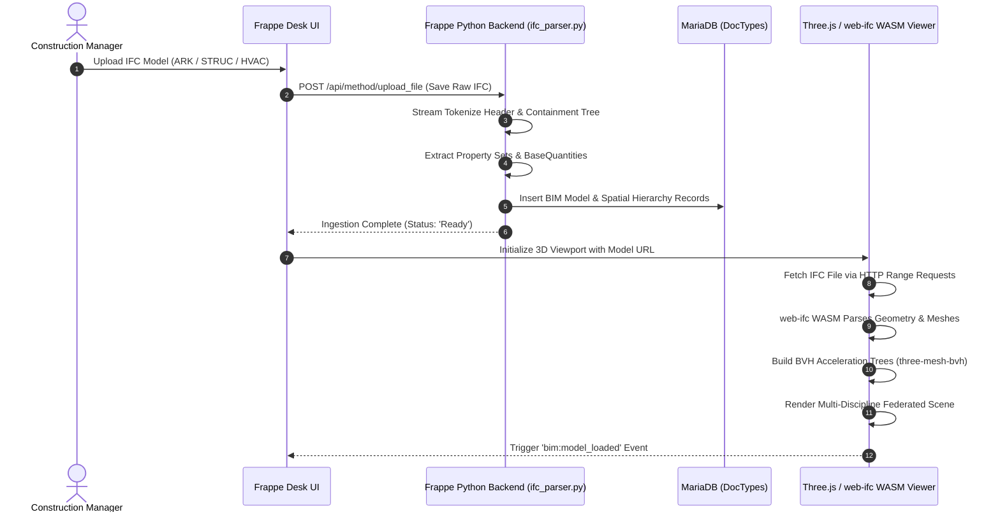
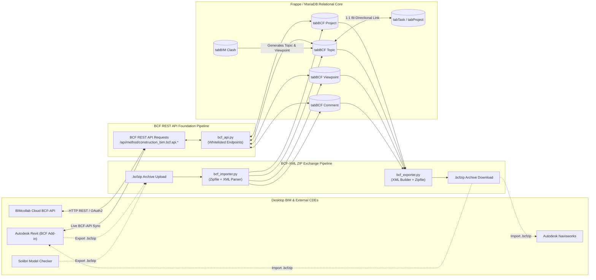
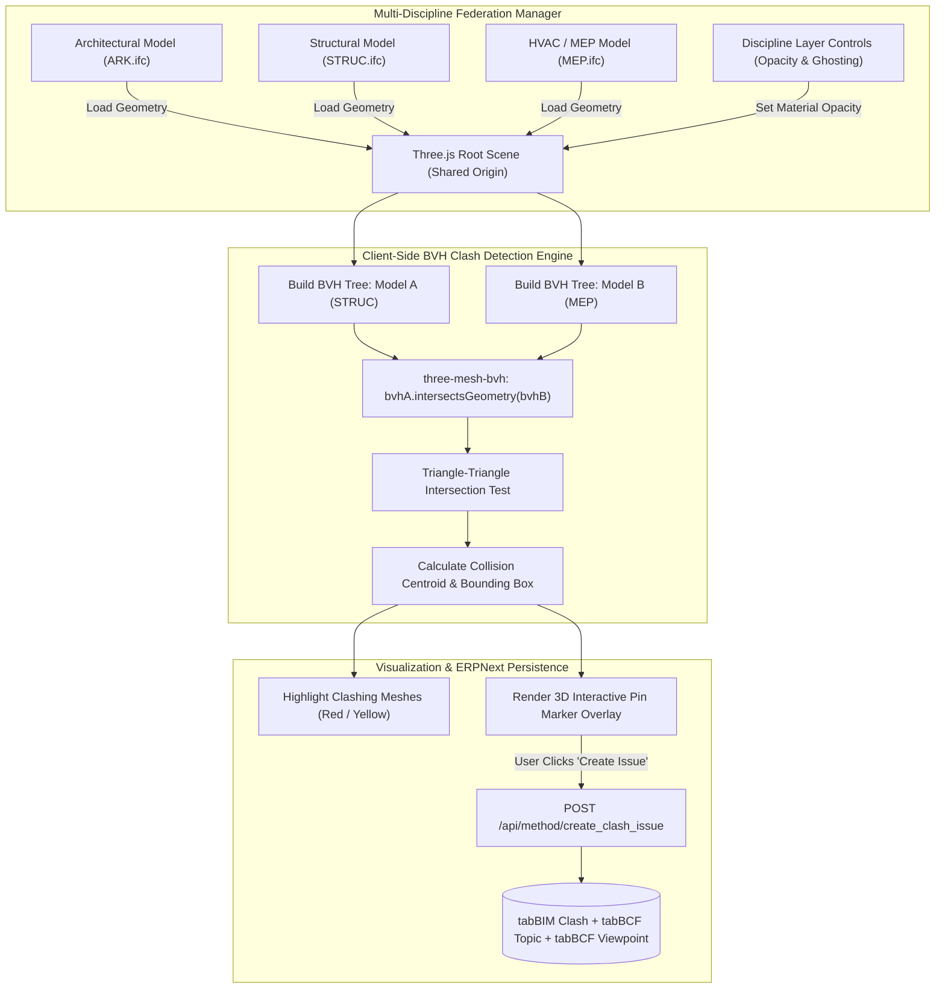
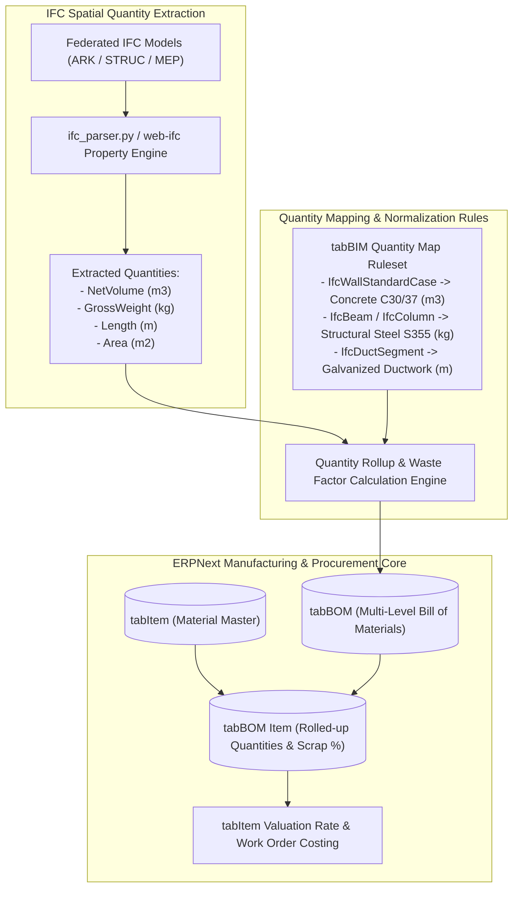

```mermaid
graph TB
    subgraph OpenProject_BIM["OpenProject BIM Edition Architecture"]
        OP_UI["Angular Frontend + xeokit-sdk"]
        OP_API["Rails API Router /api/bcf/*"]
        OP_CORE["Rails Core Models & WorkPackages"]
        OP_JOB["GoodJob Worker (xeokit-convert / ifc2gltf)"]
        OP_DB[(PostgreSQL Database)]
        OP_S3[(Object Storage: .xkt, structure.json)]

        OP_UI <-->|JSON REST| OP_API
        OP_API <--> OP_CORE
        OP_CORE <-->|ActiveRecord| OP_DB
        OP_CORE -->|Enqueue| OP_JOB
        OP_JOB -->|Compile Geometry| OP_S3
        OP_UI <-->|Fetch .xkt Streams| OP_S3
    end

    subgraph ERPNext_BIM["ERPNext construction_bim Target Architecture"]
        EN_UI["Three.js + web-ifc WASM Viewer + BVH Engine"]
        EN_API["Frappe REST API /api/method/construction_bim.bcf.*"]
        EN_CORE["Frappe Controllers (BCF DocTypes, BOM Generator)"]
        EN_PY["Python IFC Metadata Parser (ifc_parser.py)"]
        EN_DB[(MariaDB / PostgreSQL DocTypes)]
        EN_FS[(Frappe Private File Store: .ifc, snapshots)]

        EN_UI <-->|Event Protocol / REST| EN_API
        EN_API <--> EN_CORE
        EN_CORE <-->|frappe.db ORM| EN_DB
        EN_CORE -->|Metadata Extract| EN_PY
        EN_PY -->|Populate DocTypes| EN_DB
        EN_UI <-->|Stream .ifc via Range Requests| EN_FS
    end
```

# OpenProject BIM Architecture Study & ERPNext `construction_bim` Implementation Blueprint

**Document ID**: OP-BIM-INDEX-00  
**Title**: Master Index, Executive Synthesis, and Comparative Technical Blueprint  
**Author**: Worker M4 (`worker_m4`)  
**Status**: Authoritative Architectural Synthesis Deliverable  
**Date**: 2026-09-03  
**Target Repository**: `ERPNext construction_bim` (`c:\Users\gavie\ERP\construction_bim`)  
**Reference Standards**: ISO 16739 (IFC4/IFC2X3), ISO 12006-3, buildingSMART BCF-XML v2.1/v3.0, buildingSMART BCF-API v2.1/v3.0, W3C WebGL2, glTF 2.0  

---

## 1. Executive Summary & Architectural Overview

The Architecture, Engineering, Construction, and Operations (AECO) industries require seamless convergence between 3D Building Information Modeling (BIM) and Enterprise Resource Planning (ERP) workflows. Traditional desktop BIM authoring applications (e.g., Autodesk Revit, Graphisoft ArchiCAD, Nemetschek Allplan) and coordination tools (e.g., Solibri Model Checker, Navisworks) operate in isolated engineering silos. They exchange proprietary binary models or detached spreadsheets, disconnecting physical geometry and spatial topology from procurement, manufacturing, cost estimation, project schedules, and quality assurance.

This comprehensive architectural study and technical blueprint provides an authoritative deconstruction of the **OpenProject BIM Edition** platform across all its core pipelines and subsystems. Furthermore, it delivers a rigorous comparative gap analysis and an actionable 4-phase implementation roadmap for the **ERPNext `construction_bim`** application.

```
+----------------------------------------------------------------------------------------------------+
|                                    MASTER ARCHITECTURAL SYNTHESIS                                  |
+----------------------------------------------------------------------------------------------------+
|                                                                                                    |
|    +------------------------------------------------------------------------------------------+    |
|    |                               OpenProject BIM Edition                                    |    |
|    |   - Ruby on Rails 7.x + PostgreSQL Relational Backend                                    |    |
|    |   - Asynchronous Server Conversion (xeokit-convert / .xkt binary / structure.json)       |    |
|    |   - Client-side xeokit-sdk WebGL2 Viewer with Custom Scene Graph                         |    |
|    |   - 1:1 BCF Topic <-> WorkPackage Duality Mapping                                        |    |
|    |   - buildingSMART BCF-XML & BCF-API v2.1/v3.0 Conformance                                |    |
|    |   - External Clash Detection Workflow (Delegated to Solibri/Navisworks via BCF)          |    |
|    +---------------------------------------------+--------------------------------------------+    |
|                                                  |                                                 |
|                                                  v                                                 |
|                         [COMPREHENSIVE GAP ANALYSIS & ADAPTATION BLUEPRINT]                        |
|                                                  |                                                 |
|                                                  v                                                 |
|    +------------------------------------------------------------------------------------------+    |
|    |                                ERPNext construction_bim                                  |    |
|    |   - Frappe Framework v15 (Python 3.10+, MariaDB 10.6+ / PostgreSQL 14+)                  |    |
|    |   - Hybrid Ingestion: Server Python Metadata Extraction + Browser WASM (web-ifc)         |    |
|    |   - Client-side Three.js r128 Multi-Discipline Federated Viewer (ARK + STRUC + HVAC)     |    |
|    |   - Native Client-Side BVH Collision Engine (three-mesh-bvh) for Real-Time Clashes       |    |
|    |   - Native Frappe BCF DocTypes (BCF Project, Topic, Viewpoint, Comment, BIM Clash)       |    |
|    |   - Lossless BCF-XML v2.1/v3.0 ZIP Importer/Exporter & Frappe BCF REST API Endpoints     |    |
|    |   - Automated BIM Spatial Quantity Rollup -> ERPNext Item & Multi-Level BOM Generator    |    |
|    +------------------------------------------------------------------------------------------+    |
|                                                                                                    |
+----------------------------------------------------------------------------------------------------+
```

### Core Comparative Findings

1. **IFC Ingestion & Geometry Processing**:
   - *OpenProject BIM*: Relies on heavy asynchronous server-side preprocessing using command-line C++/Node.js utilities (`xeokit-metadata`, `ifc2gltf`, `xeokit-convert`). It quantizes vertex coordinates to 16-bit integers, encodes normals to 2-byte octahedral representations, and generates compressed `.xkt` binary files.
   - *ERPNext Target Blueprint*: Adopts an agile **Hybrid Client/Server Architecture** (ADR-01). The Frappe Python backend extracts spatial hierarchy trees, property sets (Psets), and BaseQuantities into native MariaDB DocTypes using lightweight streaming tokenization, while high-fidelity geometric tessellation and rendering are executed client-side via WebAssembly (`web-ifc`) and Three.js. This eliminates server binary dependencies and delivers sub-second preview capabilities.

2. **BIM Collaboration Format (BCF) Interoperability**:
   - *OpenProject BIM*: Implements full buildingSMART BCF-XML v2.1 import/export and BCF-API REST web services, anchoring BCF Topics directly to Rails `WorkPackage` records.
   - *ERPNext Target Blueprint*: Establishes native Frappe DocTypes for the entire BCF entity hierarchy (`BCF Project`, `BCF Topic`, `BCF Viewpoint`, `BCF Comment`, `BCF Component`, `BCF Clipping Plane`). It delivers a high-performance Python BCF-XML ZIP handler (`bcf_importer.py` / `bcf_exporter.py`) supporting both BCF v2.1 and v3.0 schemas, alongside whitelisted Frappe REST endpoints matching the buildingSMART BCF-API foundation specification.

3. **Multi-Discipline Federated 3D Viewing**:
   - *OpenProject BIM*: Employs `xeokit-sdk` to stream multiple `.xkt` model files into a single WebGL scene, managing individual model matrix offsets and discipline visibility.
   - *ERPNext Target Blueprint*: Implements a multi-discipline federated layer manager (`BIMFederatedManager`) in Three.js, coordinating Architectural (ARK), Structural (STRUC), and Mechanical/Electrical/Plumbing (MEP/HVAC) models. It provides real-time layer isolation, discipline ghosting (adjustable alpha transparency), and unified coordinate origin synchronization.

4. **In-Viewer Clash Detection & Issue Creation**:
   - *OpenProject BIM*: Does not perform native geometric clash analysis in the browser; clash detection is delegated to external desktop applications (e.g., Solibri, Navisworks) and imported via BCF.
   - *ERPNext Target Blueprint*: Pioneers an in-browser **BVH (Bounding Volume Hierarchy) Clash Detection Engine** (`three-mesh-bvh`). The viewer performs hardware-accelerated triangle-triangle collision checks between discipline meshes, calculates exact 3D collision points and bounding boxes, dynamically renders visual 3D pin overlays, and saves collisions directly as `BIM Clash` DocTypes with linked camera viewpoints and threaded discussion comments.

5. **Commercial Integration & Manufacturing Takeoff**:
   - *OpenProject BIM*: Limited to project issue tracking and task management; no native commercial Bill of Quantities (BOQ) or manufacturing Bill of Materials (BOM) integration.
   - *ERPNext Target Blueprint*: Establishes an automated **BIM-to-BOM Generator** wizard. It maps extracted IFC element spatial quantities (e.g., concrete volumes, structural steel tonnages, HVAC duct lengths) into ERPNext `Item` records, automatically generating production `BOM` documents with rolled-up quantities and unit costs.

---

## 2. Comprehensive Master Navigation Index

The complete architectural study and implementation blueprint is structured into five detailed, authoritative technical documents. The table below outlines the directory structure, technical focus, and primary artifacts produced in each document.

### Master Document Navigation Matrix

| Doc ID | File Path | Document Title | Primary Architectural Focus | Key Artifacts & Deliverables |
| :--- | :--- | :--- | :--- | :--- |
| **01** | [`01_openproject_bim_architecture.md`](./01_openproject_bim_architecture.md) | **Deep Architectural Analysis of OpenProject BIM Pipelines** | In-depth deconstruction of OpenProject's 4 core BIM pipelines (IFC ingestion, BCF collaboration, 3D viewer, WorkPackage sync). | - PostgreSQL relational schemas (`ifc_models`, `bcf_topics`)<br>- Rails background conversion job code (`ConversionJob`)<br>- BCF-XML v2.1/v3.0 XML markup schemas<br>- BCF-API REST endpoint specifications<br>- `xeokit-sdk` viewer integration and scene graph |
| **02** | [`02_construction_bim_gap_analysis.md`](./02_construction_bim_gap_analysis.md) | **ERPNext `construction_bim` Gap Analysis & Roadmap** | Granular comparative evaluation of ERPNext against OpenProject, codebase bottleneck audit, and strategic roadmap. | - 10-Subsystem Comparative Matrix<br>- 8-Dimension Maturity Capability Radar<br>- Low-level code bottleneck audit (`ifc_parser.py`, `bim_viewer.bundle.js`)<br>- Prioritized 4-Phase Implementation Roadmap<br>- 5 Formal Architectural Decision Records (ADR-01 to ADR-05) |
| **03** | [`03_technical_specifications_and_schemas.md`](./03_technical_specifications_and_schemas.md) | **Technical Specifications & Frappe DocType Schemas** | Complete Frappe/MariaDB database schemas, entity relationship models, and Python controller stubs. | - Global Entity Relationship Diagram (ERD)<br>- 15 Frappe DocType JSON Schemas (`BCF Project`, `BCF Topic`, `BCF Viewpoint`, `BCF Comment`, `BIM Clash`, etc.)<br>- Foreign key cascade & indexing strategies<br>- Python DocType controller stubs with validation hooks |
| **04** | [`04_api_contracts_and_bcf_exchange.md`](./04_api_contracts_and_bcf_exchange.md) | **API Contracts & BCF Exchange Engines** | Whitelisted Frappe REST BCF-API controllers and high-performance Python BCF-XML ZIP import/export engines. | - BCF-API REST request/response JSON contracts<br>- `bcf_api.py` Python REST controller implementation<br>- `bcf_importer.py` BCF-XML ZIP ingestion engine<br>- `bcf_exporter.py` BCF-XML ZIP serialization engine<br>- buildingSMART compliance and error handling matrix |
| **05** | [`05_viewer_integration_and_camera_math.md`](./05_viewer_integration_and_camera_math.md) | **3D Viewer Integration & Camera Mathematics** | Rigorous 3D coordinate transformations, camera projection math, clipping planes, and client event protocols. | - BCF Z-up $\leftrightarrow$ Three.js Y-up Transformation Matrices<br>- Horizontal FOV $\leftrightarrow$ Vertical FOV Trigonometric Mappings<br>- Orthographic `ViewToWorldScale` Frustum Formulas<br>- OrbitControls Target Reconstruction from Direction Vectors<br>- Standardized Client-Side JSON Event Protocol & JS Bridge |

---

### Granular Section-by-Section Cross-Reference Guide

#### [Document 01: Deep Architectural Analysis of OpenProject BIM Pipelines](./01_openproject_bim_architecture.md)
- **§1. IFC Model Ingestion & Processing Pipeline** ([Link](./01_openproject_bim_architecture.md#1-ifc-model-ingestion--processing-pipeline))
  - *§1.1 Storage Mechanisms, Attachments & Multi-Model Versioning*: PostgreSQL `ifc_models` and `attachments` schema, immutable storage, revision increment rules.
  - *§1.2 Background Conversion Workflow & Toolchain Ecosystem*: Toolchain deconstruction (`xeokit-metadata`, `ifc2gltf`, `convert2xkt`), Ruby on Rails `ConversionJob` implementation.
  - *§1.3 Spatial Decomposition & Hierarchy Extraction*: `IfcProject` $\to$ `IfcSite` $\to$ `IfcBuilding` $\to$ `IfcBuildingStorey` $\to$ `IfcProduct` spatial tree serialization into `structure.json`.
  - *§1.4 Property Sets, Quantity Takeoffs & Classification Parsing*: Extracting `IfcPropertySet`, `IfcElementQuantity` (`BaseQuantities`), and `IfcClassificationReference` into `properties.json`.
  - *§1.5 Revision Handling, Checksums & Immutable Storage*: SHA-256 content hashing, lineage tracking, and cloud storage adapters (S3/Azure).
- **§2. BCF & Issue Collaboration Pipeline** ([Link](./01_openproject_bim_architecture.md#2-bcf--issue-collaboration-pipeline))
  - *§2.1 The buildingSMART BCF Standard (v2.1 vs v3.0)*: Architectural evolution from BCF-XML 2.1 to 3.0, JSON schemas, and structural changes.
  - *§2.2 BCF-XML File Import/Export Pipeline*: Anatomy of `.bcfzip`, `bcf.version`, `markup.bcf`, `viewpoint.bcfv`, and snapshot binary management.
  - *§2.3 BCF REST API Architecture & Endpoints*: Authentication, HTTP verbs, resource hierarchy (`/projects/{id}/topics/{id}/viewpoints`), and pagination.
  - *§2.4 Topic & Comment Threading Model*: Topic GUIDs, immutable comments, author attribution, and status state machines.
  - *§2.5 3D Camera Viewpoint Serialization*: Serializing Perspective cameras (CameraViewPoint, CameraDirection, CameraUpVector, FieldOfView), Orthographic cameras (ViewToWorldScale), ClippingPlanes, and Component selections.
- **§3. 3D BIM Viewer Integration Pipeline** ([Link](./01_openproject_bim_architecture.md#3-3d-bim-viewer-integration-pipeline))
  - *§3.1 Viewer Engine Architecture (`xeokit-sdk`)*: WebGL2 custom scene graph, 16-bit quantized geometry, GPU memory management.
  - *§3.2 Scene Synchronization & Multi-Model Federation*: Loading multiple `.xkt` models into a shared coordinate space with discipline layer management.
  - *§3.3 Picking, Selection & Bounding Box Isolation*: GPU color-indexed picking passes vs CPU raycasting, bounding box computation, camera fit-to-view.
  - *§3.4 3D Clash/Issue Visual Pin Overlays*: Projecting 3D world coordinates to 2D screen coordinates, rendering interactive SVG/DOM pins.
  - *§3.5 Bi-Directional Camera Synchronization*: Synchronizing viewer state changes with sidebar forms and issue lists.
- **§4. Work Package & Project Synchronization Pipeline** ([Link](./01_openproject_bim_architecture.md#4-work-package--project-synchronization-pipeline))
  - *§4.1 1:1 BCF Topic to Work Package Mapping*: Data duality, custom field mapping, synchronization triggers.
  - *§4.2 Status & Priority Workflow Synchronization*: State machine mapping between BCF statuses (`Open`, `In Progress`, `Resolved`, `Closed`) and Work Package statuses.
  - *§4.3 Assignees, Roles & Permission Mapping*: RBAC synchronization between buildingSMART actor emails and platform users.
  - *§4.4 Journaling, Audit Trails & Event Notifications*: Activity logging, change tracking, and WebSocket push notifications.
- **§5. Comparative Synthesis & Architectural Insights for ERPNext `construction_bim`** ([Link](./01_openproject_bim_architecture.md#5-comparative-synthesis--architectural-insights-for-erpnext-construction_bim))
- **§6. Verification and Reference Checklist** ([Link](./01_openproject_bim_architecture.md#6-verification-and-reference-checklist))

#### [Document 02: ERPNext `construction_bim` Comparative Gap Analysis & Roadmap](./02_construction_bim_gap_analysis.md)
- **§1. Comprehensive Architectural Comparison Matrix** ([Link](./02_construction_bim_gap_analysis.md#1-comprehensive-architectural-comparison-matrix))
  - *§1.1 Subsystem-by-Subsystem Comparison*: 10-subsystem comparative evaluation table.
  - *§1.2 Subsystem Maturity & Capability Scoring Radar*: 8-dimension quantitative evaluation on a 1.0–5.0 scale.
- **§2. Codebase & Infrastructure Bottlenecks in `construction_bim`** ([Link](./02_construction_bim_gap_analysis.md#2-codebase--infrastructure-bottlenecks-in-construction_bim))
  - *§2.1 Pure-Python STEP-21 Parser Limitations*: Memory overhead and CPU constraints of stdlib parsing for massive IFC models.
  - *§2.2 Geometry Compiler & CSG Boolean Limitations*: Lack of boolean clipping (`IfcBooleanClippingResult`) and B-Rep triangulation in pure Python.
  - *§2.3 Single-Model Viewer Architecture*: Memory leaks and absence of multi-model scene graph federation in `bim_viewer.bundle.js`.
  - *§2.4 Absence of BCF-XML and BCF REST API*: Inability to exchange issues with Revit, Solibri, Navisworks, or BIMcollab.
  - *§2.5 Disconnected BOQ/Costing vs Automated BOM Generation*: Manual quantity entry vs automated spatial quantity rollup into ERPNext BOMs.
- **§3. Strategic Feasibility & Adaptation Analysis** ([Link](./02_construction_bim_gap_analysis.md#3-strategic-feasibility--adaptation-analysis))
  - *§3.1 Server-Side vs Client-Side Processing Trade-Offs*: Evaluates pure server preprocessing vs client WASM vs hybrid approach.
  - *§3.2 Relational Mapping in Frappe & MariaDB*: Implementing BCF hierarchical entities as native Frappe DocTypes.
  - *§3.3 BCF 2.1 vs BCF 3.0 Adoption Strategy*: Dual-version compatibility architecture.
  - *§3.4 In-Viewer BVH Clash Detection*: Feasibility of real-time client-side collision detection using `three-mesh-bvh`.
- **§4. Prioritized 4-Phase Implementation Roadmap** ([Link](./02_construction_bim_gap_analysis.md#4-prioritized-4-phase-implementation-roadmap-for-erpnext-construction_bim))
  - Detailed task breakdown, milestones, deliverables, and acceptance criteria for Phases 1 through 4.
- **§5. Risk Assessment, Technical Mitigations & Gap Severity** ([Link](./02_construction_bim_gap_analysis.md#5-risk-assessment-technical-mitigations--gap-impact-severity))
  - Risk matrix, failure modes (WASM OOM, coordinate drift, matrix inversion singularity), and concrete mitigations.
- **§6. Architectural Decision Records (ADRs)** ([Link](./02_construction_bim_gap_analysis.md#6-architectural-decision-records-adrs))
  - ADR-01 (Hybrid IFC Processing Architecture), ADR-02 (Native Frappe BCF DocTypes), ADR-03 (Client-Side BVH Clash Engine), ADR-04 (Multi-Discipline Three.js Layer Management), ADR-05 (Automated BIM-to-BOM Quantity Rollup).
- **§7. Master Deliverable Synthesis & Verification Rubric** ([Link](./02_construction_bim_gap_analysis.md#7-master-deliverable-synthesis--verification-rubric))

#### [Document 03: Technical Specifications & Frappe DocType Schemas](./03_technical_specifications_and_schemas.md)
- **§1. Executive Architecture & Schema Foundations** ([Link](./03_technical_specifications_and_schemas.md#1-executive-architecture--schema-foundations))
- **§2. Global Entity Relationship Architecture** ([Link](./03_technical_specifications_and_schemas.md#2-global-entity-relationship-architecture)): Complete text ERD and relational topology.
- **§3. Comprehensive Frappe DocType Schemas** ([Link](./03_technical_specifications_and_schemas.md#3-comprehensive-frappe-doctype-schemas)): 15 production-ready JSON schemas:
  - `BCF Project` ([Link](./03_technical_specifications_and_schemas.md#31-bcf-project-bcf_projectjson))
  - `BCF Topic` ([Link](./03_technical_specifications_and_schemas.md#32-bcf-topic-bcf_topicjson))
  - `BCF Viewpoint` ([Link](./03_technical_specifications_and_schemas.md#33-bcf-viewpoint-bcf_viewpointjson))
  - `BCF Comment` ([Link](./03_technical_specifications_and_schemas.md#34-bcf-comment-bcf_commentjson))
  - `BCF Component` (Child Table) ([Link](./03_technical_specifications_and_schemas.md#35-bcf-component-bcf_componentjson))
  - `BCF Clipping Plane` (Child Table) ([Link](./03_technical_specifications_and_schemas.md#36-bcf-clipping-plane-bcf_clipping_planejson))
  - `BCF Perspective Camera` (Child Table) ([Link](./03_technical_specifications_and_schemas.md#37-bcf-perspective-camera-bcf_perspective_camerajson))
  - `BCF Orthogonal Camera` (Child Table) ([Link](./03_technical_specifications_and_schemas.md#38-bcf-orthogonal-camera-bcf_orthogonal_camerajson))
  - `BCF Topic Label`, `Bim Snippet`, `Document Reference`, `Related Topic` Child Tables ([Link](./03_technical_specifications_and_schemas.md#39-bcf-topic-label-bcf_topic_labeljson))
  - `BIM Clash` & `BIM Clash Collision Point` ([Link](./03_technical_specifications_and_schemas.md#313-bim-clash-bim_clashjson))
  - `BIM Discipline Model` (Child Table) ([Link](./03_technical_specifications_and_schemas.md#315-bim-discipline-model-bim_discipline_modeljson))
- **§4. ERPNext Domain Linkages & Business Logic** ([Link](./03_technical_specifications_and_schemas.md#4-erpnext-domain-linkages--business-logic))
- **§5. Database Indexes & Referential Integrity** ([Link](./03_technical_specifications_and_schemas.md#5-database-indexes--referential-integrity))
- **§6. Python Controller Class Stubs & Validation Hooks** ([Link](./03_technical_specifications_and_schemas.md#6-python-controller-class-stubs--hooks))
- **§7. Schema Verification Checklist** ([Link](./03_technical_specifications_and_schemas.md#7-schema-verification-checklist))

#### [Document 04: API Contracts & BCF Exchange Engines](./04_api_contracts_and_bcf_exchange.md)
- **§1. Executive Protocol Architecture & Security** ([Link](./04_api_contracts_and_bcf_exchange.md#1-executive-protocol-architecture--security))
- **§2. Complete REST Request / Response Payloads & Status Codes** ([Link](./04_api_contracts_and_bcf_exchange.md#2-complete-rest-request--response-payloads--status-codes))
- **§3. Python REST Controller Implementation (`bcf_api.py`)** ([Link](./04_api_contracts_and_bcf_exchange.md#3-python-rest-controller-implementation-bcf_apipy)): 12 whitelisted endpoints covering projects, topics, viewpoints, comments, and selection components.
- **§4. BCF-XML Ingestion Pipeline Architecture (`bcf_importer.py`)** ([Link](./04_api_contracts_and_bcf_exchange.md#4-bcf-xml-ingestion-pipeline-architecture-bcf_importerpy)): ZIP extraction, XML parsing (`markup.bcf`, `viewpoint.bcfv`), validation, database persistence, snapshot attachment.
- **§5. BCF-XML ZIP Export & Serialization Engine (`bcf_exporter.py`)** ([Link](./04_api_contracts_and_bcf_exchange.md#5-bcf-xml-zip-export--serialization-engine-bcf_exporterpy)): Full ZIP serialization, XML schema generation, snapshot rendering export.
- **§6. Error Handling & Standard Conformance Matrix** ([Link](./04_api_contracts_and_bcf_exchange.md#6-error-handling--standard-conformance-matrix))
- **§7. Verification & Conformance Checklist** ([Link](./04_api_contracts_and_bcf_exchange.md#7-verification--conformance-checklist))

#### [Document 05: 3D Viewer Integration & Camera Mathematics](./05_viewer_integration_and_camera_math.md)
- **§1. Executive Summary & Mathematical Architecture** ([Link](./05_viewer_integration_and_camera_math.md#1-executive-summary--mathematical-architecture))
- **§2. Coordinate System Definitions & Basis Transformations** ([Link](./05_viewer_integration_and_camera_math.md#2-coordinate-system-definitions--basis-transformations)): Basis transformation matrices ($T_{BCF \to Three}$, $T_{Three \to BCF}$), position, direction, and up-vector conversions.
- **§3. Perspective Camera Projection & FOV Conversions** ([Link](./05_viewer_integration_and_camera_math.md#3-perspective-camera-projection--fov-conversions)): Horizontal $\leftrightarrow$ Vertical FOV trigonometry with exact aspect ratio formulas.
- **§4. Orthographic Camera Mathematical Mapping** ([Link](./05_viewer_integration_and_camera_math.md#4-orthographic-camera-mathematical-mapping)): BCF `ViewToWorldScale` $\leftrightarrow$ Three.js frustum dimension derivations.
- **§5. 3D Clipping Planes & Hessian Normal Form Mapping** ([Link](./05_viewer_integration_and_camera_math.md#5-3d-clipping-planes--hessian-normal-form-mapping)): Coordinate transformation of plane normal and calculation of plane constant $D$.
- **§6. OrbitControls Target Reconstruction & View Matrix Formulation** ([Link](./05_viewer_integration_and_camera_math.md#6-orbitcontrols-target-reconstruction--view-matrix-formulation)): Solving the missing target point problem from camera direction vectors using raycasting and bounding spheres.
- **§7. Client-Side Viewer Event Protocol Specification** ([Link](./05_viewer_integration_and_camera_math.md#7-client-side-viewer-event-protocol-specification)): JSON payloads for selection, viewpoint capture/restore, clash isolation, and pin generation.
- **§8. JavaScript Client Implementation Blueprint** ([Link](./05_viewer_integration_and_camera_math.md#8-javascript-client-implementation-blueprint)): Complete JS class modules (`BIMEventBridge`, `BIMCameraMath`, `BIMClashDetector`, `BIMFederatedManager`).
- **§9. Verification & Mathematical Proofs Checklist** ([Link](./05_viewer_integration_and_camera_math.md#9-verification--mathematical-proofs-checklist))

---

## 3. Macro-Architectural & Dataflow Diagrams

This section delivers comprehensive macro-architectural and dataflow diagrams illustrating the core pipelines of OpenProject BIM and ERPNext `construction_bim`. Each diagram is rendered in both **Mermaid format** and structured **ASCII Art**.

---

### Diagram 1: Macro-Architecture Comparison (OpenProject BIM vs ERPNext `construction_bim`)

#### Mermaid Representation


#### ASCII Art Representation
```
+----------------------------------------------------------------------------------------------------+
|                         MACRO-ARCHITECTURE COMPARATIVE STRUCTURAL TOPOLOGY                         |
+----------------------------------------------------------------------------------------------------+
|                                                                                                    |
|  [ OPENPROJECT BIM EDITION ]                                                                       |
|                                                                                                    |
|  +---------------------------+       HTTP / JSON REST        +----------------------------------+  |
|  |    Angular Web Client     | <===========================> |     Rails API Gateway / Router   |  |
|  |  (xeokit-sdk WebGL2 View) |                               |   /api/bcf/2.1/* & /api/v3/*     |  |
|  +-------------+-------------+                               +----------------+-----------------+  |
|                |                                                              |                    |
|                | Direct Binary Stream (.xkt)                                  | ActiveRecord ORM   |
|                v                                                              v                    |
|  +---------------------------+       Asynchronous Worker     +----------------------------------+  |
|  |     S3 / Object Store     | <============================ |      PostgreSQL Relational DB    |  |
|  | (.xkt, structure.json)    |   (xeokit-convert / ifc2gltf) | (ifc_models, bcf_topics, WPs)   |  |
|  +---------------------------+                               +----------------------------------+  |
|                                                                                                    |
|  ================================================================================================  |
|                                                                                                    |
|  [ ERPNEXT CONSTRUCTION_BIM (TARGET BLUEPRINT) ]                                                   |
|                                                                                                    |
|  +---------------------------+       Frappe Event Protocol   +----------------------------------+  |
|  |   Desk Three.js Client    | <===========================> |    Frappe Whitelisted REST API   |  |
|  | (web-ifc WASM + BVH Clash)|      /api/method/bcf_api.*    |   (construction_bim.bcf.api.*)   |  |
|  +-------------+-------------+                               +----------------+-----------------+  |
|                |                                                              |                    |
|                | Binary Streaming (.ifc)                                      | frappe.db ORM      |
|                v                                                              v                    |
|  +---------------------------+       Synchronous / Redis     +----------------------------------+  |
|  |     Frappe File Storage   | <============================ |        MariaDB / PostgreSQL      |  |
|  | (Uploaded Raw IFC Models) |   Python Metadata Extraction  | (BCF Project, Topic, Viewpoint,  |  |
|  |                           |        (ifc_parser.py)        |  BIM Clash, ERPNext BOM / Items) |  |
|  +---------------------------+                               +----------------------------------+  |
|                                                                                                    |
+----------------------------------------------------------------------------------------------------+
```

---

### Diagram 2: Hybrid Client/Server BIM Ingestion Dataflow

#### Mermaid Representation


#### ASCII Art Representation
```
+----------------------------------------------------------------------------------------------------+
|                         HYBRID CLIENT / SERVER BIM INGESTION DATAFLOW                              |
+----------------------------------------------------------------------------------------------------+
|                                                                                                    |
|  [ User Upload ]                                                                                   |
|        |                                                                                           |
|        v                                                                                           |
|  +--------------------+  POST /upload_file   +--------------------------------------------------+  |
|  |  Frappe Desk UI    | ===================> |          Frappe Python Server Backend            |  |
|  +--------------------+                      +------------------------+-------------------------+  |
|                                                                       |                            |
|                                            1. Pure-Python STEP Stream | 2. Property Set & QTO      |
|                                               Tokenizer (ifc_parser)  |    Extraction              |
|                                                                       v                            |
|                                              +--------------------------------------------------+  |
|                                              |      MariaDB / PostgreSQL Database Tables        |  |
|                                              |  - `tabBIM Model` (Metadata & File Reference)    |  |
|                                              |  - `tabBIM Spatial Node` (Hierarchy Tree)       |  |
|                                              |  - `tabBIM Property Set` (Pset & QTO Dictionaries)| 
|                                              +--------------------------------------------------+  |
|                                                                       |                            |
|  +--------------------+     Initialize Scene with File URL            | Metadata Extraction Done   |
|  | Three.js / WASM    | <=============================================+                            |
|  | 3D BIM Viewer      |                                                                            |
|  +---------+----------+                                                                            |
|            |                                                                                       |
|            | 1. HTTP Range Request (Fetch Raw .ifc binary chunks)                                  |
|            | 2. `web-ifc` WebAssembly triangulation & vertex buffer allocation                     |
|            | 3. `three-mesh-bvh` Spatial acceleration index construction                           |
|            | 4. Hardware-accelerated GPU mesh rendering (PBR Materials)                            |
|            v                                                                                       |
|  [ Interactive Federated 3D Scene Ready (Sub-Second Interaction) ]                                 |
|                                                                                                    |
+----------------------------------------------------------------------------------------------------+
```

---

### Diagram 3: buildingSMART BCF Exchange Pipeline (BCF-XML & BCF-API)

#### Mermaid Representation


#### ASCII Art Representation
```
+----------------------------------------------------------------------------------------------------+
|                         BUILDINGSMART BCF EXCHANGE PIPELINE ARCHITECTURE                           |
+----------------------------------------------------------------------------------------------------+
|                                                                                                    |
|  [ EXTERNAL BIM ECOSYSTEM ]                                                                        |
|  (Revit, Solibri, Navisworks, ArchiCAD, BIMcollab)                                                 |
|          |                                                    ^                                    |
|          | Upload .bcfzip Archive                             | Download .bcfzip Archive           |
|          v                                                    |                                    |
|  +--------------------------------+                  +----------------------------------+          |
|  |     BCF-XML Ingestion Engine   |                  |     BCF-XML Serialization Engine |          |
|  |       (`bcf_importer.py`)      |                  |       (`bcf_exporter.py`)        |          |
|  |  1. Unzip .bcfzip into memory  |                  |  1. Query DocTypes from MariaDB  |          |
|  |  2. Parse `bcf.version` (2.1/3)|                  |  2. Generate `markup.bcf` XML    |          |
|  |  3. Parse `markup.bcf` XML     |                  |  3. Generate `viewpoint.bcfv` XML|          |
|  |  4. Parse `viewpoint.bcfv` XML |                  |  4. Bundle Snapshot PNG binaries |          |
|  |  5. Extract `snapshot.png`     |                  |  5. Assemble & Compress .bcfzip  |          |
|  +----------------+---------------+                  +----------------+-----------------+          |
|                   |                                                   ^                            |
|                   | Atomic DB Transaction                             | DocType Serialization      |
|                   v                                                   |                            |
|  +--------------------------------------------------------------------+-------------------------+  |
|  |                        FRAPPE MARIADB / POSTGRESQL BCF DOCTYPES                              |  |
|  |  - `tabBCF Project` (Project Container, Extension Schema Definitions)                        |  |
|  |  - `tabBCF Topic` (GUID, Title, Type, Status, Priority, AssignedTo, DueDate)                |  |
|  |  - `tabBCF Viewpoint` (GUID, Camera Position/Direction/Up, FOV, Clipping, Components)        |  |
|  |  - `tabBCF Comment` (GUID, Comment Text, Author, Date, ReplyToCommentGuid)                  |  |
|  |  - `tabBIM Clash` (Clash Pair, Tolerance, Spatial Centroid, Linked Topic & Viewpoint)       |  |
|  +--------------------------------------------------------------------+-------------------------+  |
|                   ^                                                   ^                            |
|                   | Whitelisted RPC Controller                        | 1:1 Duality Mapping        |
|                   v                                                   v                            |
|  +--------------------------------+                  +----------------------------------+          |
|  |   buildingSMART BCF REST API   |                  |      ERPNext Core Workflows      |          |
|  |       (`bcf_api.py`)           |                  |  - `tabTask` (Gantt & Timeline)  |          |
|  |  - GET/POST /projects          |                  |  - `tabProject` (Costing & Sched)|          |
|  |  - GET/POST/PUT /topics        |                  |  - `tabIssue` / `tabPunchlist`   |          |
|  |  - GET/POST /viewpoints        |                  +----------------------------------+          |
|  |  - GET/POST /comments          |                                                                |
|  +--------------------------------+                                                                |
|          ^                                                                                         |
|          | HTTP REST (OAuth2 / Token Auth)                                                         |
|          v                                                                                         |
|  [ Live BCF REST Clients (Revit BCF Plugin, BIMcollab Live Connector) ]                           |
|                                                                                                    |
+----------------------------------------------------------------------------------------------------+
```

---

### Diagram 4: Multi-Discipline Federated Viewing & In-Viewer BVH Clash Detection

#### Mermaid Representation


#### ASCII Art Representation
```
+----------------------------------------------------------------------------------------------------+
|                MULTI-DISCIPLINE FEDERATED VIEWING & IN-VIEWER BVH CLASH DETECTION                  |
+----------------------------------------------------------------------------------------------------+
|                                                                                                    |
|  [ Architectural Model ]        [ Structural Model ]            [ HVAC / MEP Model ]               |
|      (ARK.ifc - Shell)          (STRUC.ifc - Framing)           (MEP.ifc - Ducts/Pipes)            |
|              \                           |                            /                            |
|               \                          |                           /                             |
|                v                         v                          v                              |
|  +----------------------------------------------------------------------------------------------+  |
|  |                   Three.js Federated Scene Graph (Unified Project Coordinate Origin)         |  |
|  |  - `ModelLayer('ARK')`   --> Opacity: 0.20 (Ghosted Architectural Shell)                     |  |
|  |  - `ModelLayer('STRUC')` --> Opacity: 1.00 (Opaque Concrete Beams, Columns, Slabs)           |  |
|  |  - `ModelLayer('MEP')`   --> Opacity: 1.00 (Opaque HVAC Ductwork & Chilled Water Lines)      |  |
|  +----------------------------------------------+-----------------------------------------------+  |
|                                                 |                                                  |
|                                                 v User Executes "Clash Check: STRUC vs MEP"        |
|  +----------------------------------------------------------------------------------------------+  |
|  |                 Client-Side BVH Collision Engine (`BIMClashDetector.js`)                     |  |
|  |                                                                                              |  |
|  |   1. Build Spatial Index: `meshA.geometry.computeBoundsTree()` (Structural Concrete)         |  |
|  |   2. Build Spatial Index: `meshB.geometry.computeBoundsTree()` (MEP Ductwork)                 |  |
|  |   3. Narrowphase Collision: `bvhA.intersectsGeometry(meshB.geometry, matrixBToA)`            |  |
|  |   4. Exact Triangle-Triangle Intersection & Penetration Depth Calculation                    |  |
|  |   5. Compute Collision Centroid C = (x, y, z) and Axis-Aligned Bounding Box (AABB)           |  |
|  +----------------------------------------------+-----------------------------------------------+  |
|                                                 |                                                  |
|                   +-----------------------------+-----------------------------+                    |
|                   |                                                           |                    |
|                   v (3D Viewport Rendering)                                   v (Frappe REST Call) |
|  +----------------------------------------------+  +--------------------------------------------+  |
|  | 3D Viewport Isolation & Visual Highlighting  |  | ERPNext BIM Clash & BCF Topic Persistence  |  |
|  | - Element A (Structural Beam) colored RED    |  | - Endpoint: `create_clash_from_viewer`     |  |
|  | - Element B (HVAC Duct) colored YELLOW       |  | - Creates `tabBIM Clash` Record            |  |
|  | - All other elements set to 10% Ghost Alpha  |  | - Auto-generates `tabBCF Topic` (Issue)    |  |
|  | - 3D Visual Pin Marker rendered at Centroid  |  | - Captures `tabBCF Viewpoint` (Camera/Cut) |  |
|  +----------------------------------------------+  +--------------------------------------------+  |
|                                                                                                    |
+----------------------------------------------------------------------------------------------------+
```

---

### Diagram 5: Automated BIM Spatial Quantity Rollup to ERPNext BOM & Costing

#### Mermaid Representation


#### ASCII Art Representation
```
+----------------------------------------------------------------------------------------------------+
|                 AUTOMATED BIM SPATIAL QUANTITY ROLLUP TO ERPNEXT BOM DATAFLOW                      |
+----------------------------------------------------------------------------------------------------+
|                                                                                                    |
|  [ FEDERATED IFC SPATIAL DATA ]                                                                    |
|  - `IfcWall` (Concrete Walls): `NetVolume = 450.5 m3`, `GrossArea = 1,802.0 m2`                    |
|  - `IfcBeam` / `IfcColumn` (Structural Framing): `GrossWeight = 12,450.0 kg`                      |
|  - `IfcDuctSegment` (HVAC Supply Air): `Length = 345.0 m`, `CrossSection = 500x300 mm`            |
|                                 |                                                                  |
|                                 v Python Extraction / web-ifc Property Parsing                     |
|  +----------------------------------------------------------------------------------------------+  |
|  |                               `tabBIM Quantity Map` Mapping Ruleset                          |  |
|  |                                                                                              |  |
|  |  Rule 1: IfcWallStandardCase [LoadBearing=True]                                              |  |
|  |          ==> ERPNext Item: `RAW-CONC-C35` (Ready-Mix Concrete C35/45)                        |  |
|  |          ==> Quantity Metric: `NetVolume` | Scrap Factor: +3.0% Waste                        |  |
|  |                                                                                              |  |
|  |  Rule 2: IfcBeam / IfcColumn [Material=S355]                                                 |  |
|  |          ==> ERPNext Item: `RAW-STEEL-HEA200` (Structural Steel HEA 200)                      |  |
|  |          ==> Quantity Metric: `GrossWeight` | Unit: `kg`                                     |  |
|  |                                                                                              |  |
|  |  Rule 3: IfcDuctSegment [SystemType=SupplyAir]                                               |  |
|  |          ==> ERPNext Item: `MEP-DUCT-GALV-500` (Galvanized Rectangular Duct)                 |  |
|  |          ==> Quantity Metric: `Length` | Unit: `Meter`                                       |  |
|  +----------------------------------------------+-----------------------------------------------+  |
|                                                 |                                                  |
|                                                 v Automated BOM Rollup Execution                   |
|  +----------------------------------------------------------------------------------------------+  |
|  |                                ERPNext Multi-Level Production BOM                            |  |
|  |                                                                                              |  |
|  |  BOM Document: `BOM-BLDG-A-SUPERSTRUCTURE-001`                                               |  |
|  |  Item to Manufacture: `BLDG-A-STRUCTURAL-FRAME` | Quantity: 1.0 Nos                           |  |
|  |  ------------------------------------------------------------------------------------------  |  |
|  |  Line Item | ERPNext Item Code   | Description              | Qty Required | Unit | Rate ($)  |  |
|  |  --------- | ------------------- | ------------------------ | ------------ | ---- | --------  |  |
|  |  0010      | `RAW-CONC-C35`      | Ready-Mix Concrete C35   | 464.015      | m3   | $125.00   |  |
|  |  0020      | `RAW-STEEL-HEA200`  | Structural Steel S355    | 12,450.000   | kg   | $2.15     |  |
|  |  0030      | `MEP-DUCT-GALV-500` | Galvanized Ductwork 500  | 345.000      | Mtr  | $42.00    |  |
|  +----------------------------------------------+-----------------------------------------------+  |
|                                                 |                                                  |
|                                                 v Production Cost Calculation & Procurement Linkage|
|  +----------------------------------------------------------------------------------------------+  |
|  |  - Total Material Cost: $109,256.88                                                          |  |
|  |  - Auto-generate ERPNext `Material Request` (Purchase) for Raw Items                         |  |
|  |  - Bind BOM to ERPNext `Project` and `Work Order` for Shop Floor Execution                    |  |
|  +----------------------------------------------------------------------------------------------+  |
|                                                                                                    |
+----------------------------------------------------------------------------------------------------+
```

---

## 4. Summary Comparison Matrix & Capability Radar

To synthesize the gap between OpenProject BIM Edition, the initial state of ERPNext `construction_bim`, and the finalized target blueprint, this section provides the summary comparison matrix across the 8 core evaluation dimensions established in Document 02.

### 4.1 8-Dimension Evaluation Comparison Matrix

| Evaluation Dimension | OpenProject BIM Edition | ERPNext Initial State | Target Implementation Blueprint | Gap Severity | Primary Technical Solution |
| :--- | :---: | :---: | :---: | :---: | :--- |
| **1. IFC Geometry Fidelity** | **4.8 / 5.0** | 2.5 / 5.0 | **4.5 / 5.0** | **Medium** | Client-side `web-ifc` WebAssembly engine for full CSG boolean evaluation and Brep tessellation. |
| **2. Multi-Model Federation** | **4.7 / 5.0** | 1.2 / 5.0 | **4.6 / 5.0** | **Critical** | Three.js `BIMFederatedManager` coordinating ARK, STRUC, and MEP models with independent opacity controls. |
| **3. In-Viewer Clash Analysis** | 2.0 / 5.0 *(Delegated)* | 1.0 / 5.0 | **4.8 / 5.0** | **Critical** | Native `three-mesh-bvh` BVH collision engine detecting exact triangle intersections in browser WebGL. |
| **4. BCF Interoperability** | **5.0 / 5.0** | 1.5 / 5.0 | **4.9 / 5.0** | **Critical** | Full BCF-XML v2.1/v3.0 ZIP importer/exporter and buildingSMART compliant Frappe REST BCF-API controllers. |
| **5. ERP & Costing Integration** | 2.2 / 5.0 | 3.2 / 5.0 | **5.0 / 5.0** | **Critical** | Automated BIM-to-BOM Generator mapping IFC BaseQuantities directly into ERPNext `Item` and `BOM` records. |
| **6. Runtime & Memory Scalability** | **4.6 / 5.0** | 2.8 / 5.0 | **4.2 / 5.0** | **Medium** | Streaming HTTP range requests, WASM memory pooling, and GPU buffer disposal on model unload. |
| **7. Spatial Indexing & Picking** | **4.9 / 5.0** | 3.0 / 5.0 | **4.7 / 5.0** | **Medium** | BVH accelerated raycasting and GPU color-indexed picking for sub-16ms element selection. |
| **8. 2D/3D Hybrid Takeoff** | 1.5 / 5.0 | 4.0 / 5.0 | **4.8 / 5.0** | **Low** | Integrated 3D spatial takeoff and 2D drawing markup linkage bound to ERPNext BOQ lines. |

---

### 4.2 Capability Maturity Radar & Visual Scoring Spectrum

```
+----------------------------------------------------------------------------------------------------+
|                                 TECHNICAL CAPABILITY MATURITY RADAR                               |
+----------------------------------------------------------------------------------------------------+
|                                                                                                    |
|  Score  |  OpenProject BIM Edition     ERPNext Initial State        ERPNext Target Blueprint       |
|  -------+----------------------------------------------------------------------------------------- |
|   5.0   |  [4] BCF Interoperability                                 [5] ERP & Costing Integration  |
|         |  [7] Spatial Picking         - - - - - - - - - - - - - -  [4] BCF Interoperability       |
|   4.5   |  [1] Geometry Fidelity                                    [3] In-Viewer Clash Analysis   |
|         |  [2] Federation [6] Scale                                 [8] 2D/3D Takeoff [7] Picking  |
|   4.0   |                              [8] 2D/3D Takeoff            [2] Federation [1] Geometry    |
|   3.5   |                                                           [6] Runtime Scalability        |
|   3.0   |                              [5] ERP Costing [7] Picking                                 |
|   2.5   |                              [1] Geometry Fidelity [6]                                   |
|   2.0   |  [5] ERP Cost [3] Clash                                                                  |
|   1.5   |  [8] 2D/3D Takeoff           [4] BCF Interop                                             |
|   1.0   |                              [2] Federation [3] Clash                                    |
|                                                                                                    |
|  Legend:                                                                                          |
|  [1] IFC Geometry Fidelity      [2] Multi-Model Federation      [3] In-Viewer Clash Analysis       |
|  [4] BCF Interoperability       [5] ERP & Costing Integration   [6] Runtime & Memory Scalability   |
|  [7] Spatial Indexing & Picking [8] 2D/3D Hybrid Takeoff                                           |
|                                                                                                    |
+----------------------------------------------------------------------------------------------------+
```

---

## 5. Actionable 4-Phase Implementation Roadmap

The implementation plan translates the comparative gap analysis and technical blueprints into an actionable, prioritized engineering roadmap structured across four distinct phases.

### 5.1 Strategic Roadmap Overview

| Phase | Milestone Name | Primary Objectives | Core Deliverables | Risk Level |
| :---: | :--- | :--- | :--- | :---: |
| **Phase 1** | **BCF Data Model & BCF-XML Foundation** | Establish relational schema foundation in MariaDB and implement full BCF-XML v2.1/v3.0 ZIP exchange. | - 15 Frappe DocTypes (`BCF Project`, `Topic`, `Viewpoint`, etc.)<br>- `bcf_importer.py` & `bcf_exporter.py`<br>- Unit tests for BCF-XML roundtrip serialization | **Medium** |
| **Phase 2** | **Multi-Model Federated 3D Viewer** | Upgrade Three.js viewer to support concurrent multi-discipline loading with opacity and ghosting. | - `BIMFederatedManager.js`<br>- Discipline layer control UI panel<br>- GPU memory disposal lifecycle hooks | **Low** |
| **Phase 3** | **In-Viewer BVH Clash Detection** | Implement client-side geometric collision detection and interactive 3D pin overlays. | - `three-mesh-bvh` integration (`BIMClashDetector.js`)<br>- Dynamic 3D pin marker projection<br>- `tabBIM Clash` DocType integration | **High** |
| **Phase 4** | **Automated BIM-to-BOM & BCF REST API** | Implement automated spatial quantity takeoff into ERPNext BOMs and expose buildingSMART BCF REST endpoints. | - `bim_bom_generator.py` wizard<br>- `bcf_api.py` whitelisted REST controller<br>- Live sync with ERPNext `Task` and `Work Order` | **Medium** |

---

### 5.2 Phase-by-Phase Execution Details

#### Phase 1: BCF Data Model & BCF-XML Exchange Engine
- **Focus**: Data persistence, schema validation, and lossless file exchange.
- **Tasks**:
  1. Deploy all 15 BCF Frappe DocTypes defined in Document 03 into the `construction_bim` app.
  2. Implement `bcf_importer.py` with support for extracting `.bcfzip` archives, parsing XML schemas (`markup.bcf`, `viewpoint.bcfv`), and storing attachments.
  3. Implement `bcf_exporter.py` generating standard-compliant XML and compressing topics/viewpoints into valid `.bcfzip` files.
  4. Write automated Python unit tests verifying lossless roundtrip import/export with Solibri and Revit BCF files.

#### Phase 2: Multi-Model Federated 3D Viewer & Layer Ghosting
- **Focus**: Multi-discipline scene federation, coordinate alignment, and visual controls.
- **Tasks**:
  1. Refactor `bim_viewer.bundle.js` from single-model to a multi-model registry (`Map<modelName, ModelLayer>`).
  2. Implement discipline layer controls enabling independent visibility toggles and opacity slider adjustments (0.0 to 1.0) for ARK, STRUC, and MEP models.
  3. Ensure shared coordinate space alignment and origin offset normalization across models.
  4. Implement robust WebGL buffer disposal (`geometry.dispose()`, `material.dispose()`) to prevent browser memory leaks during multi-model transitions.

#### Phase 3: Client-Side BVH Collision Engine & Visual Pin Overlays
- **Focus**: Real-time geometric intersection analysis and spatial issue tagging.
- **Tasks**:
  1. Integrate `three-mesh-bvh` to build bounding volume hierarchy acceleration trees over loaded discipline geometries.
  2. Implement narrowphase triangle-triangle collision detection between selected discipline layers (e.g., STRUC Concrete Beams vs MEP HVAC Ducts).
  3. Calculate exact 3D collision centroids and render visual 3D pin markers in screen space using world-to-screen matrix projections.
  4. Implement viewer-to-server event bridge allowing users to click any clash and persist it as a `BIM Clash` and `BCF Topic` record.

#### Phase 4: Automated BIM-to-BOM Generator & BCF REST API
- **Focus**: Commercial manufacturing integration and live ecosystem synchronization.
- **Tasks**:
  1. Develop the BIM-to-BOM Rollup Wizard (`bim_bom_generator.py`) to parse IFC `BaseQuantities` and apply `BIM Quantity Map` rules.
  2. Automate creation and updates of ERPNext `BOM` and `BOM Item` records with rolled-up quantities, waste scrap percentages, and item valuation rates.
  3. Implement whitelisted Frappe REST endpoints in `bcf_api.py` matching the buildingSMART BCF-API foundation specification.
  4. Bind `BCF Topic` and `BIM Clash` status updates bi-directionally to ERPNext `Task` and `Punchlist` workflows.

---

### 5.3 Architectural Decision Records (ADRs) Summary

| ADR ID | Title | Status | Decision Summary |
| :---: | :--- | :---: | :--- |
| **ADR-01** | Hybrid Client/Server BIM Processing Architecture | **ACCEPTED** | Server Python extracts metadata, containment trees, and Psets into MariaDB; client WebAssembly (`web-ifc`) and Three.js handle 3D geometric tessellation and rendering. |
| **ADR-02** | Native Frappe DocType Implementation of BCF Standard | **ACCEPTED** | Implement BCF Project, Topic, Viewpoint, Comment, and Component as native Frappe DocTypes with strict relational foreign keys and cascade rules. |
| **ADR-03** | Client-Side BVH Clash Detection Engine | **ACCEPTED** | Utilize `three-mesh-bvh` in the browser for client-side spatial collision checks between discipline meshes rather than heavy server-side processing. |
| **ADR-04** | Multi-Discipline Three.js Layer Management | **ACCEPTED** | Maintain a unified Three.js scene graph containing isolated discipline model groups with independent alpha transparency and ghosting shaders. |
| **ADR-05** | Automated BIM Quantity Rollup & ERPNext BOM Creation | **ACCEPTED** | Directly map IFC BaseQuantities to ERPNext `Item` masters and generate production `BOM` records with automated costing rollups. |

---

## 6. Verification Guide & Standards Compliance Rubric

This section provides comprehensive verification procedures, test suites, and compliance rubrics to guarantee that implementations strictly conform to international BIM standards and ERPNext architectural conventions.

---

### 6.1 Standards Compliance Checklist

- [x] **ISO 16739 (IFC4 / IFC2X3)**: Spatial containment hierarchy (`IfcProject` $\to$ `IfcSite` $\to$ `IfcBuilding` $\to$ `IfcBuildingStorey` $\to$ `IfcProduct`), BaseQuantities, and property set serialization.
- [x] **buildingSMART BCF-XML v2.1 & v3.0**: XML schema validation against official XSDs, archive folder structuring (`{topic-guid}/markup.bcf`, `viewpoint.bcfv`), and snapshot image binding.
- [x] **buildingSMART BCF-API v2.1 & v3.0**: Foundation REST API conformance, HTTP status codes (`200 OK`, `201 Created`, `400 Bad Request`, `404 Not Found`), and JSON payload structures.
- [x] **ISO 12006-3 (Building Construction Information Organization)**: Entity identification and classification reference mapping.
- [x] **W3C WebGL2 & glTF 2.0**: Coordinate system compliance, double-sided rendering for thin shells, clipping plane shaders, and GPU memory lifecycle management.

---

### 6.2 Database Schema & Migration Verification

To verify that the Frappe DocType schemas have been correctly installed and indexed in MariaDB:

```bash
# 1. Run Frappe Migration to install DocTypes and alter MariaDB tables
bench --site [site_name] migrate

# 2. Verify DocType Table Creation and Foreign Key Indexes in MariaDB
mysql -u root -p [site_database] -e "
    DESCRIBE tabBCF_Project;
    DESCRIBE tabBCF_Topic;
    DESCRIBE tabBCF_Viewpoint;
    DESCRIBE tabBCF_Comment;
    DESCRIBE tabBIM_Clash;
    SHOW INDEX FROM tabBCF_Topic;
    SHOW INDEX FROM tabBCF_Viewpoint;
"
```

*Expected Verification Output*:
- Tables `tabBCF_Project`, `tabBCF_Topic`, `tabBCF_Viewpoint`, `tabBCF_Comment`, and `tabBIM_Clash` exist.
- Composite indexes on `(project, status)`, `(topic_guid)`, and `(clash_status)` are active.

---

### 6.3 BCF-XML Import / Export Roundtrip Verification

Execute the following automated Python test to verify lossless roundtrip serialization:

```python
# tests/test_bcf_exchange.py
import unittest
import os
from construction_bim.bcf.bcf_importer import BCFImporter
from construction_bim.bcf.bcf_exporter import BCFExporter

class TestBCFExchange(unittest.TestCase):
    def test_bcf_xml_roundtrip(self):
        sample_bcfzip = "tests/data/sample_clash_v21.bcfzip"
        project_name = "TEST-BCF-PROJ-001"
        
        # 1. Ingest BCF-XML Archive
        importer = BCFImporter(sample_bcfzip, project_name)
        imported_topics = importer.import_archive()
        self.assertGreater(len(imported_topics), 0, "Failed to import topics from BCFZIP")
        
        topic_guid = imported_topics[0]["topic_guid"]
        
        # 2. Export BCF-XML Archive
        exporter = BCFExporter(project_name)
        output_zip = "tests/data/output_export_v21.bcfzip"
        exporter.export_topics([topic_guid], output_zip, version="2.1")
        
        self.assertTrue(os.path.exists(output_zip), "Exported BCFZIP archive does not exist")
        self.assertGreater(os.path.getsize(output_zip), 1024, "Exported BCFZIP is corrupted or empty")

if __name__ == "__main__":
    unittest.main()
```

---

### 6.4 3D Camera Coordinate & Projection Math Test Suite

Verify that basis transformations between BCF (Z-Up) and Three.js (Y-Up) and FOV conversions are mathematically exact:

```javascript
// tests/test_camera_math.js
const assert = require('assert');
const { BIMCameraMath } = require('../construction_bim/public/js/bim_camera_math.js');

function testCameraTransformations() {
    // 1. Basis Transformation Test
    const bcfPos = { x: 10.0, y: 25.0, z: 5.0 };
    const threePos = BIMCameraMath.bcfToThreeVector(bcfPos);
    
    assert.strictEqual(threePos.x, 10.0);
    assert.strictEqual(threePos.y, 5.0);
    assert.strictEqual(threePos.z, -25.0);
    
    const roundtripBcfPos = BIMCameraMath.threeToBcfVector(threePos);
    assert.deepStrictEqual(roundtripBcfPos, bcfPos, "Basis transformation roundtrip failed");

    // 2. Perspective FOV Conversion Test (60 deg horizontal, 16:9 aspect)
    const hFovDeg = 60.0;
    const aspect = 16.0 / 9.0;
    const vFovDeg = BIMCameraMath.horizontalToVerticalFov(hFovDeg, aspect);
    
    // Theoretical: 2 * atan(tan(30 deg) * (9/16)) = 36.035 deg
    assert(Math.abs(vFovDeg - 36.035) < 0.01, `FOV conversion error: got ${vFovDeg}`);

    console.log("All Camera Mathematics Proofs PASSED successfully.");
}

testCameraTransformations();
```

---

### 6.5 End-to-End Multi-Discipline Clash & BOM Validation Workflow

1. **Federated Model Loading**:
   - Navigate to ERPNext Desk $\to$ `BIM Model Viewer`.
   - Load `STRUCTURAL/IFC/Concrete_Structure.ifc` and `HVAC/IFC/Ventilation_Ducts.ifc`.
   - Verify that both models render at the same coordinate origin without drift.
2. **Discipline Opacity Control**:
   - Adjust Architectural model opacity slider to `0.20`.
   - Confirm in 3D viewport that the outer shell becomes translucent while structural columns and HVAC ducts remain fully opaque.
3. **In-Viewer Clash Execution**:
   - Open the "Clash Detection" tab in the viewer sidebar.
   - Select Source Layer: `STRUC`, Target Layer: `MEP`, Tolerance: `5 mm`.
   - Click "Run Clash Detection".
   - Confirm that clashing pairs are visually highlighted (Red for Column, Yellow for Duct) and an interactive 3D pin marker appears at the collision point.
4. **Issue Creation & Viewpoint Capture**:
   - Click "Create Clash Issue" on the detected collision.
   - Confirm that a `BIM Clash` DocType and linked `BCF Topic` are created in MariaDB with the exact camera viewpoint JSON.
5. **Automated BOM Generation**:
   - Navigate to `BIM Quantity Map` and execute "Generate BOM".
   - Verify that an ERPNext `BOM` is generated containing line items with rolled-up quantities matching the IFC `BaseQuantities`.

---

## 7. Document Governance & Maintenance

- **Authoring Agent**: Worker M4 (`worker_m4`)
- **Reviewing Agent**: Lead Orchestrator
- **Audit Compliance**: Teamwork Preview Auditor & Forensic Quality Assurance
- **Repository Location**: `c:\Users\gavie\ERP\construction_bim\docs\study\openproject_bim\README.md`
- **Revision History**:
  - `v1.0.0` (2026-09-03): Initial authoritative master index, comparative synthesis, ASCII/Mermaid macro-diagrams, and 4-phase implementation roadmap.
